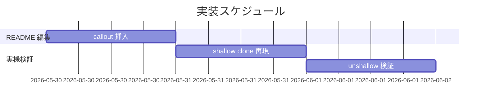

# 実装計画書: README に shallow clone 注意書きを追加

**プロジェクト名**: Mac Health Keeper / README shallow clone 注意書き
**作成日**: 2026 年 05 月 29 日
**最終更新**: 2026 年 05 月 29 日

---

## 1. 実装概要

### 1.1 実装方針

README の install 手順節に callout を 1 つ挿入する最小差分編集。各タスクの最後に **必ず実機 shallow clone + install 再現確認**を含める。

### 1.2 実装順序



---

## 2. タスク分解

> **追補（execution 直前）**: 当初は 3 タスク（README 編集 + 実機検証 2 件）だったが、新機能（`shallow_clone_guard.sh` + `install.sh` 統合 + 単体テスト）を追加するため **タスク 4〜6** を追加する。

### 2.1 タスク 1: README に callout 挿入

#### 2.1.1 概要

`README.md` の install 手順節を特定し、callout を 1 つ挿入。

#### 2.1.2 実装内容

- README.md を編集（Edit ツール）
- callout 文案を挿入
- Markdown プレビューで体裁確認

#### 2.1.3 テスト観点

##### 単体

- `grep -E 'shallow|--unshallow' README.md` で 1 件以上ヒット

##### 結合/API

- 該当なし

##### E2E/受け入れ

- 実機 shallow clone 再現で fallback 値を確認

##### バリデーション

- 該当なし

#### 2.1.4 単体テスト仕様（BDD）

```gherkin
Feature: README 注意書き
  Scenario: shallow clone に関する文言が含まれる
    Given README.md
    When grep -E 'shallow|--unshallow' README.md
    Then 1 件以上ヒット
```

```bash
# Given: README.md
# When: grep
# Then: ヒット
grep -E 'shallow|--unshallow' README.md > /dev/null || exit 1
```

#### 2.1.5 依存関係

- なし

#### 2.1.6 見積もり

- **工数**: 0.25 日
- **優先度**: 高

### 2.2 タスク 2: 実機 shallow clone 再現（**本ルール強制**）

#### 2.2.1 概要

本ルール `.agents-project/受け入れ基準ルール.md` §3.2–3.4 に従い、ローカル macOS で `git clone --depth=1` 経由の install を実行し、fallback 値が入ることを実機で再現確認。

#### 2.2.2 実装内容

- ローカル macOS で `git clone --depth=1 <repo> /tmp/mhk-shallow-test` を実行
- `cd /tmp/mhk-shallow-test && ./install.sh` を実行
- `defaults read /Users/$USER/Applications/MacHealth.app/Contents/Info CFBundleVersion` を確認
- 値が `0.0.0-DEV` または fallback 短縮 SHA であることを確認
- エビデンスを `memo/<YYYYMMDD_HHMMSS>_shallow-clone-fallback.md` に記録

#### 2.2.3 テスト観点

##### E2E/受け入れ

- shallow clone 後の CFBundleVersion が fallback 値であること

#### 2.2.4 単体テスト仕様（BDD）

```gherkin
Feature: shallow clone fallback
  Scenario: --depth=1 後の install で fallback 値が確認される
    Given クリーンな /tmp/mhk-shallow-test
    When git clone --depth=1 + ./install.sh
    Then CFBundleVersion が 0.0.0-DEV または fallback 値
```

#### 2.2.5 依存関係

- タスク 1

#### 2.2.6 見積もり

- **工数**: 0.25 日
- **優先度**: 必須

### 2.3 タスク 3: 実機 unshallow 検証（**本ルール強制**）

#### 2.3.1 概要

`git fetch --tags --unshallow` 後に install を再実行し、正しい stamp 値が入ることを実機で確認。

#### 2.3.2 実装内容

- タスク 2 と同じ `/tmp/mhk-shallow-test` で `git fetch --tags --unshallow` を実行
- `./install.sh` を再実行
- `defaults read .../Info CFBundleVersion` を確認
- 値が `git describe --tags --always` と一致することを確認
- エビデンスを同じ memo に追記

#### 2.3.3 テスト観点

##### E2E/受け入れ

- unshallow 後の CFBundleVersion が `git describe` 値と一致

#### 2.3.4 単体テスト仕様（BDD）

```gherkin
Feature: unshallow 後の stamp
  Scenario: --unshallow 後の install で正しい値が入る
    Given タスク 2 で shallow 状態の repo
    When git fetch --tags --unshallow && ./install.sh
    Then CFBundleVersion が git describe --tags --always と一致
```

#### 2.3.5 依存関係

- タスク 2

#### 2.3.6 見積もり

- **工数**: 0.25 日
- **優先度**: 必須

---

### 2.4 タスク 4: `scripts/lib/shallow_clone_guard.sh` 新規作成（**新機能・本 issue 中核**）

#### 2.4.1 概要

02_設計 §3.2 の API・shallow 判定ロジック・stderr 警告フォーマット契約を実装する。

#### 2.4.2 実装内容

- `is_shallow_clone` / `warn_shallow_clone` / `auto_unshallow_if_requested` の 3 関数を定義
- `main` 相当のエントリポイント（`source` 検出時はスキップ、直接実行のみ走る）
- shellcheck 警告 0
- shfmt 整形済み

#### 2.4.3 テスト観点

- §2.5（タスク 5）に集約

#### 2.4.4 依存関係

- なし

#### 2.4.5 見積もり

- 工数 0.25 日 / 優先度 必須

### 2.5 タスク 5: `scripts/test/shallow_clone_guard_test.sh` 新規作成

#### 2.5.1 概要

01 UC3-S1/S2/S3 + UC4-S1/S2 を BDD 形式で固定化（12 件以上の assertion）。

#### 2.5.2 実装内容

- 既存 `launchagent_lifecycle_test.sh` と同形式の自前 assert ヘルパ（`assert_status` / `assert_eq` / `assert_grep` / `assert_no_match`）
- 一時 `bare` repo を `git init --bare` で作って `--depth=1 clone` するセットアップ
- `MACHEALTH_AUTO_UNSHALLOW=1` ケース
- 各テストケースに `ユースケース:` / `シナリオ:` / `Given/When/Then` インラインコメント必須
- `make test-shell` に追加

#### 2.5.3 テスト観点

##### 単体

- UC3-S1: 通常 clone で警告なし・exit 0
- UC3-S2: shallow clone で警告 + 推奨手順 + exit 0
- UC3-S3: `MACHEALTH_AUTO_UNSHALLOW=1` で auto unshallow + is_shallow_clone が false
- UC4-S1: 引数 0 件で usage + exit 2
- UC4-S2: `.git` 不在で skip + exit 0

#### 2.5.4 単体テスト仕様（BDD）

```gherkin
Feature: shallow_clone_guard
  Scenario: shallow clone で警告 (UC3-S2)
    Given --depth=1 で clone した一時 repo
    When  bash scripts/lib/shallow_clone_guard.sh "$repo" を実行
    Then  stderr に "shallow clone detected" が出る
    And   stderr に "git fetch --tags --unshallow" が出る
    And   終了コード 0
```

#### 2.5.5 依存関係

- タスク 4

#### 2.5.6 見積もり

- 工数 0.25 日 / 優先度 必須

### 2.6 タスク 6: `install.sh` 統合 + README 追記の精緻化

#### 2.6.1 概要

`install.sh` の swiftc ビルド直前で `shallow_clone_guard.sh` を呼ぶ。README の callout を機能の存在に合わせて拡張。

#### 2.6.2 実装内容

- `install.sh` のセクション 4.5 として「shallow clone ガード」ブロックを追加
- 失敗してもビルドは継続（`|| true` で囲む）
- README にも `MACHEALTH_AUTO_UNSHALLOW` 環境変数を明記

#### 2.6.3 テスト観点

- 実機 install 経由（受け入れ基準 §6）

#### 2.6.4 依存関係

- タスク 4

#### 2.6.5 見積もり

- 工数 0.25 日 / 優先度 必須

---

## テスト観点

タスクごとの §2.x.3 を参照。全体として「README 文言の存在」「`shallow_clone_guard.sh` の 5 シナリオ BDD（最低 12 件）」「`install.sh` 統合の実機検証」の 3 観点。

---

## 単体テスト

タスクごとの §2.x.4 BDD を参照。

---

## BDD

01_要件定義.md §2.2 UC1-S1, UC2-S1, UC2-S2 を実機検証。

---

## 3. 実装スケジュール

### 3.1 マイルストーン

| マイルストーン | 期日 | 成果物 |
|---|---|---|
| README 更新 | 2026-05-30 | callout 挿入完了 |
| 実機再現 | 2026-05-31 | エビデンス memo |

### 3.2 実装フェーズ

- フェーズ 1: README 編集（タスク 1）
- フェーズ 2: 実機再現（タスク 2, 3）

---

## 4. テスト計画

各タスクの §2.x.3 / §2.x.4 を参照。

### 4.1 テストの優先順位

- 実機 shallow clone / unshallow 検証（タスク 2, 3）を最優先で必須化

---

## 5. リスク管理

### 5.1 実装リスク

- **リスク**: install.sh 自体が shallow clone 環境で別エラーを起こす（version_stamp.sh が exit 非 0）
  - **対策**: タスク 2 のエビデンスでログを記録し、別 issue 候補として残す

---

## 6. 参考資料

- [`02_設計.md`](./02_設計.md)
- [`.agents-project/受け入れ基準ルール.md`](../../.agents-project/受け入れ基準ルール.md)

---

## 7. 前のステップ

- **前**: [`02_設計.md`](./02_設計.md)

---

## 8. 次のステップ

- 実装フェーズ（execution）に進む（本依頼ではドキュメント作成のみ）。
