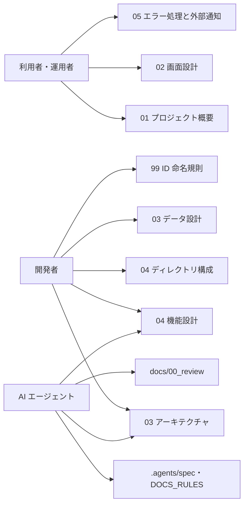

このドキュメントは、Mac Health Keeper のステークホルダー（関与者・依存外部）と、役割別ドキュメントの読み方を定義します。
システム仕様書作成ルールは [`.agents/DOCS_RULES.md`](../../../.agents/DOCS_RULES.md) を参照してください。

# 2. ステークホルダー

Mac Health Keeper は **個人マシン向けのローカル常駐ツール** であり、組織のユーザー管理や外部 SaaS 連携を持ちません。本章では「人」「外部システム」「AI エージェント」の 3 視点でステークホルダーを定義します。

---

## 2.1. 役割一覧（人）

| 役割 | 説明 | 主な関心 |
| ---- | ---- | -------- |
| **利用者（個人開発者・長期稼働者）** | 自分の macOS にインストールして使うエンドユーザー。多くは Slack / Chrome / Docker Desktop 等を常時起動する個人開発者。 | メニューバーから現状を把握できること・想定外の通知が出ないこと・自動再起動で作業を奪われないこと。 |
| **運用者（多くの場合は利用者本人）** | LaunchAgent の ON/OFF・閾値変更・トラブル時のログ確認を行う。 | 閾値設定（`scripts/config/thresholds.sh`）の編集容易性・ジョブの個別停止／全停止・ログとローテートの可視性。 |
| **開発者 / コントリビューター** | 実装・テスト・ドキュメント整備を行う。 | 層境界（UI / Domain / Infra）の明確さ・Functional Core / Imperative Shell の遵守・テスト容易性（XCTest と bats／自前ランナー）。 |

## 2.2. 役割一覧（外部システム）

| 外部システム | 関係 | 一次情報 |
| ------------ | ---- | -------- |
| **launchd** | 4 つのジョブのスケジュール起動主体。`gui/<uid>` ドメインで `launchctl bootstrap` され、`StartInterval`（monitor/docker）・`StartCalendarInterval`（uptime/refresh）で起動される。 | `launchagents/*.plist.template`・`Sources/MacHealthKit/JobController.swift`（`bootout`/`bootstrap`/`list`） |
| **macOS 通知センター** | デスクトップ通知の表示先。Swift 側は `osascript` の `on run argv` で argv 渡し、シェル側は `osascript -e "display notification …"`。 | `Sources/MacHealthKit/AppleScriptEscaper.swift`・`scripts/lib/notify.sh` |
| **Docker Desktop（任意）** | 監視対象。`pgrep -f 'com.apple.Virtualization.VirtualMachine'`（または `Docker.app` のプロセス）で起動判定し、`docker ps -q` でコンテナ数を取得（3 秒タイムアウト）。アイドル時に `osascript -e 'quit app "Docker Desktop"'` で自動 Quit。 | `scripts/bin/check-docker.sh`・`scripts/lib/metrics.sh::metrics_docker_status` |
| **対象アプリ（refresh.sh）** | Slack / Chatwork / Google Chrome / Firefox / Claude。AppRefresh で順次 `quit saving no` → 完全 quit 待機 → `open -a` 再起動。Cursor は除外（編集中ファイル保護）。 | `scripts/bin/refresh.sh`（`APPS` 配列） |
| **`memory_pressure` / `sudo purge` / `osascript` / `sysctl` / `vm_stat` / `uptime`** | クイック対処・メトリクス取得・通知に使う macOS 標準コマンド。 | `src/MacHealth.swift`・`src/MetricsCollector.swift`・`scripts/lib/metrics.sh`・`scripts/lib/notify.sh` |
| **System Events（AppleScript）** | `install.sh` がログイン項目登録に使用、`refresh.sh` がアプリ起動判定に使用。 | `install.sh`・`scripts/bin/refresh.sh::is_running` |
| **GitHub Actions（macos-latest / ubuntu-latest）** | 開発フロー側の外部実行系。PR / `main` push 時に `make check` を実行し、`main` マージ時に JST 日時タグ + GitHub Release を自動作成。 | `.github/workflows/check.yml`・`.github/workflows/create-release.yaml`・[04 機能設計 / CI・Release 自動化](../../04_機能設計/CI・Release自動化/README.md) |
| **Homebrew（任意）** | CI 上で `shellcheck` 不在時に `brew install shellcheck` でフォールバック。ローカルでは任意ツール（`shfmt` / `swift-format` / `swiftlint`）の導入手段。 | `.github/workflows/check.yml`・[`README.md` § 任意ツールの導入](../../../README.md) |

## 2.3. 役割一覧（AI エージェント）

| エージェント | 役割 | 入口 |
| ------------ | ---- | ---- |
| **Orchestrator** | ユーザーの依頼を解釈し phase 判定・command 選択・worker 委譲を行う進行役。 | `.agents/agents/orchestrator.md`・`.agents/boot/CORE.md` |
| **Worker** | 設計・実装・docs 整備など実作業を行う。本 docs 整備もこれにあたる。 | `.agents/agents/worker.md` |
| **Auditor** | レビュー（コード／設計／docs）を行う。 | `.agents/agents/auditor.md` |
| **Scribe** | 実施記録（workflow.db）への書記。`AGENT_ROLE=scribe`・`.agents/scripts/write-workflow-log.sh`。 | `.agents/agents/scribe.md`・`.agents/scribe/CONTRACT.md` |

---

## 2.4. 役割別の関心とドキュメントの読み方

### 利用者・運用者

- まず [01 プロジェクト概要](../01_プロジェクト概要/README.md) で目的とスコープを把握する。
- [02 画面設計](../../02_画面設計/README.md) でメニューバー UI の項目（メトリクス・クイック対処・ジョブ一覧）を確認する。
- 通知が想定外に多い／少ない場合は [05 エラー処理と外部通知](../../05_エラー処理と外部通知/README.md) の cooldown とエラー分類を参照する。
- ログの所在は `~/Library/Logs/MacHealth/`（[03 データ設計](../../03_データ設計/README.md)）。

### 開発者

- [03 アーキテクチャ](../03_アーキテクチャ/README.md) で **Functional Core / Imperative Shell** と **CQRS（`JobController`）**・**注入耐性（`ShellRunner` 引数配列・`AppleScriptEscaper` argv）** の方針を理解する。
- [04 ディレクトリ構成](../04_ディレクトリ構成/README.md) で各ファイルの責務と所在を確認する。
- [03 データ設計](../../03_データ設計/README.md) で値型（`MetricsSnapshot` / `JobStatus` / `MenuItemSpec` / `MenuAction` / `ScheduleKind`）と外部データ形式（cooldown ファイル・events.log・各 .log・rotate.err・launchd.\*.out/.err・plist スキーマ・ロックファイル）を確認する。
- [04 機能設計](../../04_機能設計/README.md) で各機能の処理フローを参照し、変更時の影響範囲を判断する。
- ローカルでの品質ゲートは [`make check`](../../04_機能設計/ローカル検証/README.md)。PR 時の CI / Release 自動化は [04 機能設計 / CI・Release 自動化](../../04_機能設計/CI・Release自動化/README.md)。
- 命名・ID 規則は [99 ID 命名規則と管理](../../99_ID命名規則と管理/README.md) と `.agents/spec/03_命名規則.md`。

### AI エージェント

- 実行契約は `.agents/boot/CORE.md`・`.agents/RULES.md`。**docs 更新は新規 issue 不要**（[`.agents/DOCS_RULES.md`](../../../.agents/DOCS_RULES.md)）。
- docs を更新したら [`docs/00_review/`](../../00_review/) にレビュー結果（実装整合性・更新内容）を YYYYMMDD_HHMMSS_review.md として記録する。
- 設計判断の優先順位（spec/06）: **可読性 > 単一責務 > 仕様整合 > 変更容易性 > 保守性 > 再利用性 > 実装効率**。
- 禁止命名（spec/03）: `helpers` / `misc` / `common` / `utils`。

---

## 参考資料

- [01 プロジェクト概要](../01_プロジェクト概要/README.md)
- [03 アーキテクチャ](../03_アーキテクチャ/README.md)
- [04 ディレクトリ構成](../04_ディレクトリ構成/README.md)
- [05 エラー処理と外部通知](../../05_エラー処理と外部通知/README.md)
- [`.agents/DOCS_RULES.md`](../../../.agents/DOCS_RULES.md)・[`.agents/spec/`](../../../.agents/spec/)

---

**最終更新**: 2026 年 05 月 28 日 / **maintainer**: docs worker
