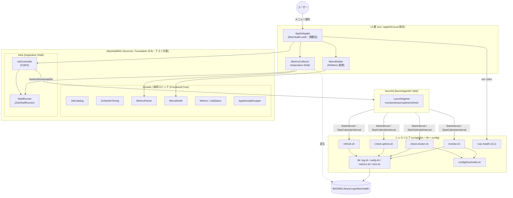
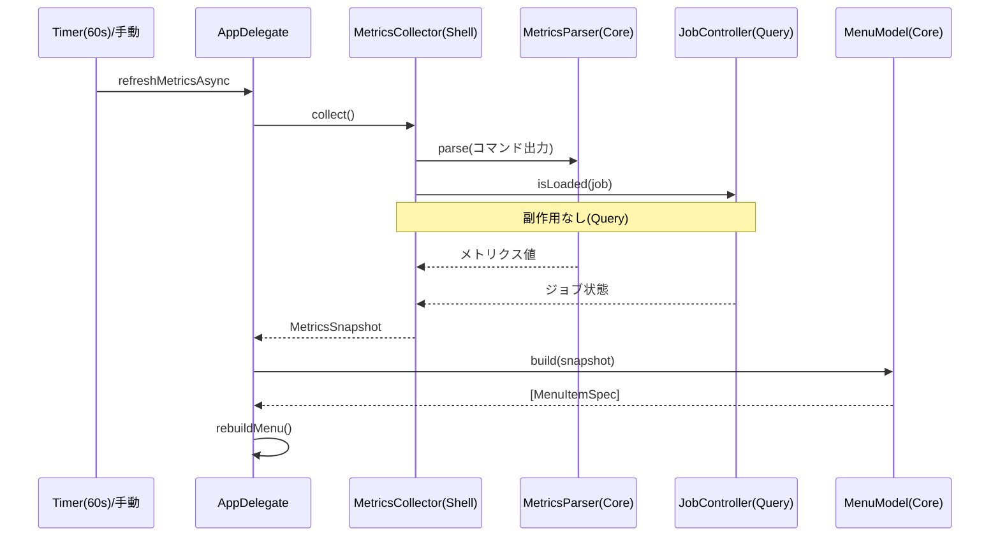
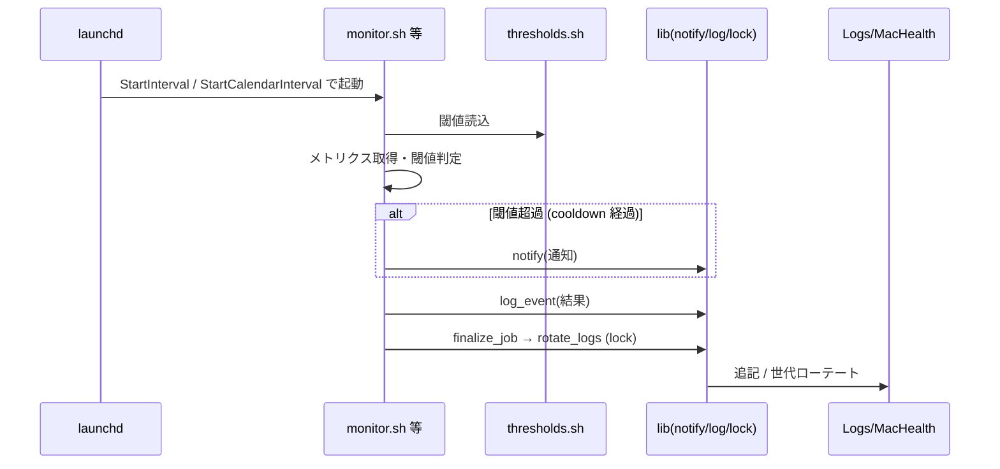
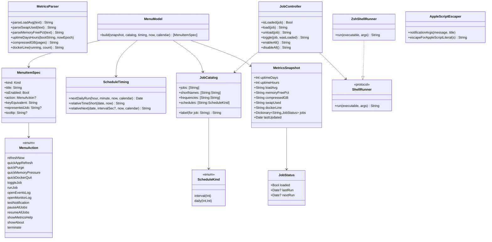
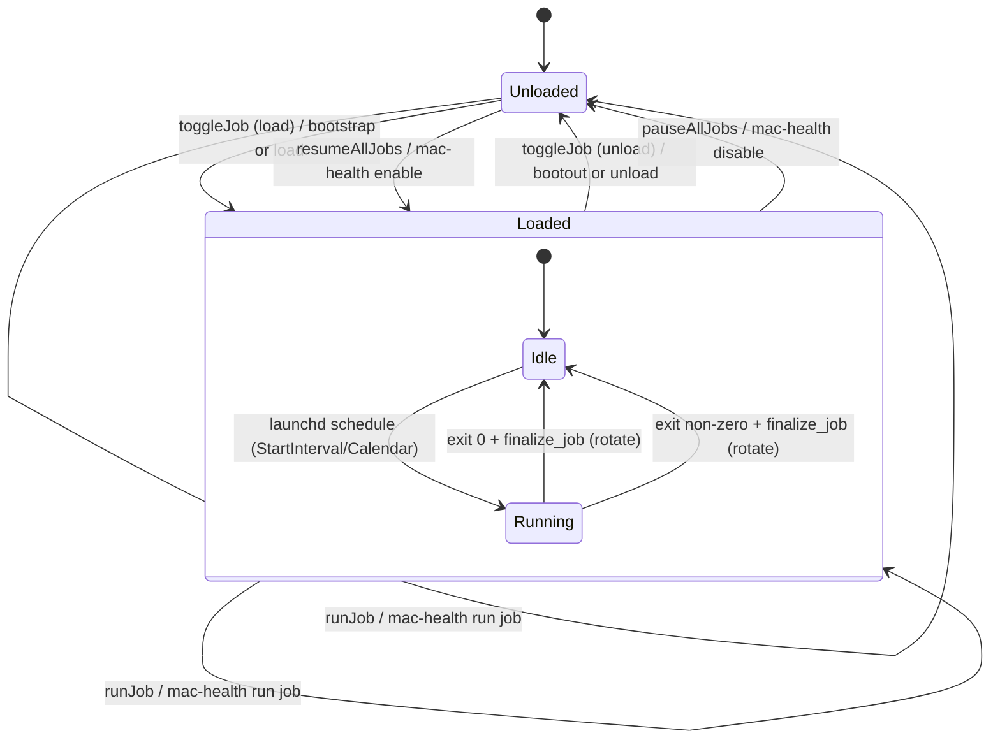
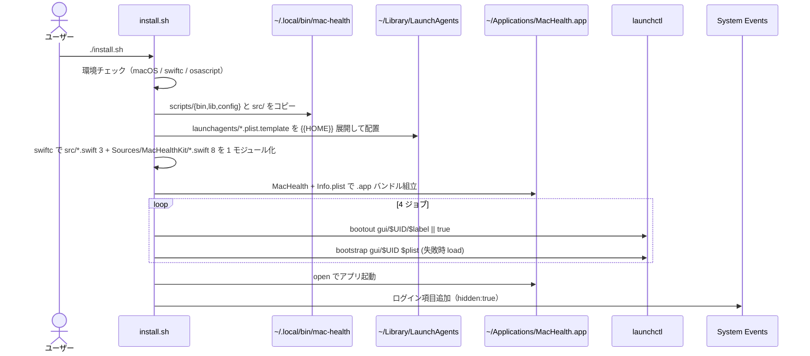

このドキュメントは、Mac Health Keeper のアーキテクチャ（層構成・技術スタック・層間連携・ジョブ一覧・ログ／通知／設定）を定義します。
システム仕様書作成ルールは [`.agents/DOCS_RULES.md`](../../../.agents/DOCS_RULES.md) を参照してください。

> 本ドキュメントは「生きているドキュメント」です。実装変更時（各サブ issue 完了時）に更新し、レビュー結果は [`docs/00_review/`](../../00_review/) に記録します。

# 3. アーキテクチャ

Mac Health Keeper は、**Functional Core / Imperative Shell** と **明確な層分離（UI / Domain / Infra）**、および **launchd 駆動のバッチジョブ** を組み合わせた構成を採ります。純粋ロジック（Functional Core）を `Sources/MacHealthKit`（Foundation のみ依存）に集約してテスト可能にし、副作用（プロセス実行・launchctl・通知）は Imperative Shell（`MetricsCollector`・`ShellRunner`・`JobController`・シェルジョブ）に閉じ込めています。

---

## 3.1. システム構成図



### 構成要素の説明（コンポーネント責務表）

各行の責務は現状実装のファイルヘッダコメントを一次情報とします。

| コンポーネント | 層 | 主な依存 | 責務（1 文） |
| -------------- | -- | -------- | ------------ |
| AppDelegate（`src/MacHealth.swift`） | UI | AppKit | メニューバー UI とユーザー操作の調整役。各層へ委譲し自身はロジックを持たない。 |
| MenuBuilder（`src/MenuBuilder.swift`） | UI | AppKit | `[MenuItemSpec]` を NSMenu / NSMenuItem へ変換する薄い AppKit 部。 |
| MetricsCollector（`src/MetricsCollector.swift`） | UI / Infra | ShellRunner, MetricsParser | 実コマンドを実行し出力を MetricsParser に委譲して MetricsSnapshot を組み立てる（Imperative Shell）。 |
| JobCatalog（`Sources/MacHealthKit/JobCatalog.swift`） | Domain | なし | ジョブ ID・短名・頻度・スケジュール種別・launchd ラベル規則の静的定義。 |
| ScheduleTiming（`Sources/MacHealthKit/ScheduleTiming.swift`） | Domain | なし | 時刻計算・相対時刻表示の純粋ロジック（now を引数化）。 |
| MetricsParser（`Sources/MacHealthKit/MetricsParser.swift`） | Domain | なし | コマンド出力テキスト → メトリクス値の純粋パース（丸め・単位・フォールバック）。 |
| MenuModel（`Sources/MacHealthKit/MenuModel.swift`） | Domain | JobCatalog, ScheduleTiming | Snapshot / JobStatus / Catalog → `[MenuItemSpec]` の純粋データ生成。 |
| Metrics（`Sources/MacHealthKit/Metrics.swift`） | Domain | なし | MetricsSnapshot / JobStatus の純粋値型。 |
| AppleScriptEscaper（`Sources/MacHealthKit/AppleScriptEscaper.swift`） | Domain / Util | なし | 通知文字列を osascript の argv で渡すための純粋関数（注入耐性）。 |
| ShellRunner（`Sources/MacHealthKit/ShellRunner.swift`） | Infra | Foundation(Process) | 実行ファイル＋引数配列で外部コマンドを直接起動（シェル再パース排除）。 |
| JobController（`Sources/MacHealthKit/JobController.swift`） | Infra | ShellRunner, JobCatalog | launchctl による状態変更（Command）と状態取得（Query）を CQRS で分離。 |
| シェルジョブ（`scripts/bin/*`） | Job | lib, config | monitor / docker / uptime / refresh と CLI `mac-health`。launchd から起動される実処理。 |
| シェル lib（`scripts/lib/*`） | Job / Infra | lock.sh | log（ローテート含む）・notify・metrics・lock の共通ユーティリティ。 |
| 設定（`scripts/config/thresholds.sh`） | Config | なし | 閾値・ローテート・クールダウン等の編集可能な設定値。 |
| launchd（`launchagents/*.plist.template`） | Scheduler | — | 各ジョブの起動スケジュール（StartInterval / StartCalendarInterval）を定義。 |

---

## 3.2. 技術スタック

| 技術 | バージョン | 用途 |
| ---- | ---------- | ---- |
| Swift | 5.7+ | アプリ本体・MacHealthKit の実装言語 |
| AppKit / Cocoa | macOS SDK | メニューバー UI（`src/`） |
| Foundation | macOS SDK | MacHealthKit の唯一の依存（Process 等） |
| Swift Package Manager / `swiftc` | - | ビルド（`Package.swift` / `Makefile`） |
| bash | - | シェルジョブ・CLI（`scripts/`） |
| launchd | - | ジョブのスケジュール起動（`launchagents/*.plist.template`） |
| osascript | - | デスクトップ通知の発行（`scripts/lib/notify.sh`） |
| XCTest | - | MacHealthKit の単体テスト（`Tests/MacHealthKitTests/`） |
| bats / `*_test.sh` | - | シェルのテスト（`scripts/test/`） |

---

## 3.3. 層間連携

### 3.3.1. UI 層 → MacHealthKit → シェル / launchd

- **UI 層（`src/`）**: AppKit に依存する薄い層。`AppDelegate` が調整役となり、UI 構築は `MenuBuilder`、メトリクス収集は `MetricsCollector`、ジョブ操作は `JobController` に委譲する。`AppDelegate` 自身は業務ロジックを持たない。
- **MacHealthKit（`Sources/`）**: Foundation のみに依存し、AppKit に依存しない。Domain（Functional Core）の純粋ロジックと Infra（Imperative Shell）の副作用境界を含む。AppKit 非依存ゆえ XCTest で単体テスト可能。
- **シェルジョブ（`scripts/`）**: launchd または CLI `mac-health` から起動される独立した実処理。共通処理は `scripts/lib/`、設定値は `scripts/config/thresholds.sh` に分離する。
- **launchd（`launchagents/`）**: 各ジョブを定義したスケジュールで起動する（§3.4）。

### 3.3.2. Functional Core / Imperative Shell

- **Functional Core（純粋ロジック）**: `JobCatalog` `ScheduleTiming` `MetricsParser` `MenuModel` `Metrics` `AppleScriptEscaper`。入力から出力を決定論的に計算し、副作用を持たない。時刻などの外部依存は引数化する（例: `ScheduleTiming` は `now` を引数で受け取る）。
- **Imperative Shell（副作用境界）**: `MetricsCollector`（コマンド実行）・`ShellRunner`（プロセス起動）・`JobController`（launchctl 実行）・シェルジョブ。外界との入出力を担い、計算は Core に委譲する。

### 3.3.3. CQRS（Command / Query 分離）

`JobController`（`Sources/MacHealthKit/JobController.swift`）は、状態変更と状態取得を分離します。

- **Command（状態変更）**: `load` / `unload` / `toggle` / `enableAll` / `disableAll`（launchctl の bootout / bootstrap）。およびシェル側のジョブ実行（monitor / docker / uptime / refresh）。
- **Query（状態取得）**: `isLoaded`（launchctl list を読むのみ・副作用なし）、`MetricsCollector.collect`（メトリクス取得）。

### 3.3.4. シェル安全化（ShellRunner の引数配列化）

`ShellRunner` は、実行ファイルと引数を **配列** で受け取りプロセスを直接起動します（`ShellRunner.run(executable:args:)`）。文字列を経由したシェルの再パースを排除し、引数注入を防ぎます。通知文字列は `AppleScriptEscaper` で osascript の argv として安全に渡します。

### 3.3.5. データフロー

**(A) UI からのメトリクス更新（Query 中心）**



**(B) launchd 駆動のジョブ実行（バッチ・「起きた事実」をログに記録）**



> **イベント駆動の注記**: 本システムはメッセージバスを持たないため、ジョブ完了は `log_event`（events.log）に「起きた事実」として記録する同期処理に留めます（JobFinalized 相当をログに記録し、明示的なイベント発行はしません）。spec/06「単純な同期処理で十分な場合は無理にイベント駆動を導入しない」に従います。

---

## 3.4. ジョブ一覧

launchd が起動する 4 つのジョブを示します。**本表の値は `launchagents/*.plist.template`（`Label` / `ProgramArguments` / `StartInterval` / `StartCalendarInterval` / `RunAtLoad`）および `Sources/MacHealthKit/JobCatalog.swift` を一次情報として一致させています。**

| ジョブ ID | 短名 | スクリプト（`scripts/bin/`） | launchd ラベル | スケジュール（plist 実値） | RunAtLoad |
| --------- | ---- | ---------------------------- | -------------- | -------------------------- | --------- |
| monitor | メモリ／負荷監視 | `monitor.sh` | `com.github.adachi-tatsuru.machealth.monitor` | StartInterval 300 秒（5 分毎） | true |
| docker | Docker アイドル監視 | `check-docker.sh` | `com.github.adachi-tatsuru.machealth.docker` | StartInterval 600 秒（10 分毎） | false |
| uptime | 長期稼働の通知 | `check-uptime.sh` | `com.github.adachi-tatsuru.machealth.uptime` | StartCalendarInterval Hour=9 / Minute=0（毎日 9:00） | false |
| refresh | アプリ自動再起動 | `refresh.sh` | `com.github.adachi-tatsuru.machealth.refresh` | StartCalendarInterval Hour=3 / Minute=0（毎日 3:00） | false |

> **頻度表記の整合**: `JobCatalog.swift` の表示用 `frequencies`（monitor=「5分毎」/ docker=「10分毎」/ uptime=「毎日 9:00」/ refresh=「毎日 3:00」）は、plist の数値（300 / 600 秒）・Calendar（9:00 / 3:00）を人間向けに表記したものであり、矛盾はありません。launchd ラベルは `JobCatalog.label(for:)` の規則 `com.github.adachi-tatsuru.machealth.<job>` と一致します。

---

## 3.5. ログ・通知・設定

| 関心事 | 実装 | 内容 |
| ------ | ---- | ---- |
| ログ | `scripts/lib/log.sh` | `$HOME/Library/Logs/MacHealth` 配下に記録。世代ローテート（`rotate_logs`）を持ち、`scripts/lib/lock.sh` の排他制御で多重実行時の競合を防ぐ。 |
| 通知 | `scripts/lib/notify.sh` | osascript でデスクトップ通知を発行。通知文字列は引数として安全に渡す。クールダウン（`scripts/bin/notification_cooldown.sh`）で短時間の通知重複を抑制。 |
| 設定 | `scripts/config/thresholds.sh` | 閾値・ローテート世代数・クールダウン等の編集可能な設定値。各ジョブが読み込む。 |
| メトリクス | `scripts/lib/metrics.sh` | メトリクス取得処理を集約。各ジョブから共通利用する。 |

ログの保存先・plist の出力先はいずれも `$HOME` / `{{HOME}}` で表記し、個人の絶対パスは記載しません。

---

## 3.6. データフローの追加図

### 3.6.1. クラス図（Domain / Infra の主要型）



### 3.6.2. ジョブ状態遷移（メニュー操作と launchctl の関係）



> `isLoaded` クエリ（`launchctl list` の出力に label を含む非空行があるか）は副作用なし。`runJob` は CLI `mac-health run <job>` を起動して即時実行する（launchd の周期とは独立）。

---

## 3.7. テスト戦略

| 層 | テスト対象 | フレームワーク | 場所 |
| -- | ---------- | -------------- | ---- |
| Domain（Functional Core） | `ScheduleTiming` / `MetricsParser` / `MenuModel` / `JobCatalog` / `AppleScriptEscaper` | XCTest（純粋・固定入力） | `Tests/MacHealthKitTests/*` |
| Infra 契約 | `ShellRunner` の引数配列契約・注入耐性、`JobController` の CQRS とフォールバック | XCTest（`SpyShellRunner` で呼出を捕捉） | `Tests/MacHealthKitTests/ShellRunnerContractTests.swift`・`ZshShellRunnerInjectionTests.swift`・`JobControllerTests.swift`・`JobControllerSafetyTests.swift` |
| UI（NSMenu 部） | `MenuBuilder` の AppKit 変換は AppKit 実依存のため XCTest 対象外（02 §6.1）。データの正しさは `MenuModelTests` が網羅 | XCTest（モデル側）／目視 | `Tests/MacHealthKitTests/MenuModelTests.swift` |
| シェル | `should_notify` / `classify_pressure` / `exceeds_threshold`（`notification_cooldown.sh`）、`metrics_*`（`metrics.sh`）、`rotate_logs`／`needs_rotation`／`next_generation`／`rotate_file`（`log.sh`） | bats（あれば）または自前 `*_test.sh` | `scripts/test/{monitor,metrics,log_rotate}{.bats,_test.sh}` |
| 集約 | XCTest と シェルテストを集約 | `make test`（XCTest 不在環境では `swift test` を skip し続行） | `Makefile` |

**境界**: 純粋ロジックは値を全網羅、副作用境界はスパイで「I/F の正しさ（引数列・順序）」のみ検証、実 I/O はテスト対象外（02 §6.1）。

---

## 3.8. ビルド / 配備フロー



- **配布ビルド**: `install.sh` 内の `swiftc` 直接コンパイル（Package.swift は使わない）。テスト用に `Package.swift`（`MacHealthKit` library + `MacHealthKitTests` test target）を保持。
- **冪等性**: 既存ジョブを `launchctl bootout` してから `bootstrap` する。アプリは事前に `osascript -e 'quit app "Mac Health"'` で停止。ログイン項目は既存なら追加しない。
- **撤去**: `uninstall.sh` で 4 ジョブ bootout → アプリ quit/削除 → ログイン項目削除 → `~/.local/bin/mac-health/` 削除 → ログは対話確認で残す/削除。

---

## 3.8.1. ローカル検証（make check）と CI / Release 自動化

`install.sh` / `swiftc` による配布ビルドとは独立に、**コード品質を担保するローカル検証 (`make check`) と GitHub Actions による CI / Release** を持ちます。配布物の所在には影響しません（CI / Release は開発フロー側の責務）。

### 3.8.1.1. ローカル検証（`make check`）

`Makefile::check` がランナーを順次呼び、終了コードを集約します（[04 機能設計 / ローカル検証](../../04_機能設計/ローカル検証/README.md)）。

| step | 呼び出し先 | ツール | 必須／任意 | 失敗時の扱い |
| ---- | ---------- | ------ | ---------- | ------------ |
| `lint-shell` | `scripts/lint/run-shellcheck.sh` | `shellcheck` | **必須**（不在は強い WARN + 非 0） | 失敗 |
| `lint-shfmt` | `scripts/lint/run-shfmt.sh` | `shfmt` | 任意（不在は SKIP） | 失敗 |
| `lint-swift-format` | `scripts/lint/run-swift-format.sh` | `swift-format` | 任意（不在は SKIP） | 失敗 |
| `lint-swiftlint` | `scripts/lint/run-swiftlint.sh` | `swiftlint` | 任意（不在は SKIP） | 失敗 |
| `check-cycles` | `scripts/lint/check-source-cycles.sh` | awk DFS（外部依存なし） | 必須 | 失敗 |
| `security-scan` | `scripts/lint/security-scan.sh` | `grep -E` | 必須 | 失敗 |
| `test` | `swift test` + `bats` または自前 `*_test.sh` | XCTest / bats | XCTest 不在は SKIP / シェルは必須 | 失敗 |

> ランナーはすべて **bash 3.2 互換**で書かれており、GNU 拡張（連想配列・`mapfile`）や `grep -P` は使いません。共通関数は `scripts/lint/lib/common.sh` に集約。

### 3.8.1.2. CI（`.github/workflows/check.yml`）

PR / `main` push 時に **macos-latest** で `make check` を自動実行します。`shellcheck` は GitHub runner に同梱されている場合があるため、`command -v shellcheck` で有無を確認し、不在時のみ `brew install shellcheck` でフォールバックします。`timeout-minutes: 30` / `permissions.contents: read` / `concurrency.group: check-${workflow}-${ref}`（`cancel-in-progress: true`）。

### 3.8.1.3. Release 自動化（`.github/workflows/create-release.yaml`）

`main` への push を契機に **ubuntu-latest** で Release を作成します。

```bash
TAG="v$(TZ=Asia/Tokyo date '+%Y%m%d.%H%M%S')"
git tag "$TAG"
git push origin "$TAG"
gh release create "$TAG" --generate-notes
```

`permissions.contents: write` / `concurrency.group: release`（`cancel-in-progress: false`）で直列化し、同時多発 push 時のタグ衝突を抑制します。Release ノートは GitHub の `--generate-notes` 機能でコミット履歴から自動生成され、リリースアセットの添付は行いません（バイナリは利用者側で `install.sh` を実行してビルドする運用）。

> ローカル検証・CI・Release はいずれも **配布物（`install.sh` 経由の `~/Applications/MacHealth.app`）には含まれません**。開発・保守フローの一部であり、エンドユーザーの実行系には影響しません。

---

## 3.9. 改善経緯（A〜F の反映）

本ドキュメントは、`.workflow/20260527_225413_規約準拠改善/` 配下の親 + 6 サブ issue（A〜F）で行った規約準拠改善の結果を反映しています。各サブの主成果は次のとおり：

| サブ | テーマ | 主要変更 | 反映先 |
| ---- | ------ | -------- | ------ |
| A | 責務単位の分離 | `src/MacHealth.swift` の肥大化を解消し、`MenuBuilder` / `MetricsCollector` を分離。Functional Core を `Sources/MacHealthKit/` に集約。 | §3.1 / §3.3 / §4（04 ディレクトリ構成） |
| B | Functional Core の純化 | `ScheduleTiming` の `Date()` / `Calendar.current` を引数化、`MetricsParser` を純粋関数化。 | §3.3.2 / §3.6.1 |
| C | metrics.sh への集約 | メトリクス取得処理を `scripts/lib/metrics.sh` に一元化（旧 sed/awk 散在を解消）。Swift も `metrics.sh <metric>` を引数呼び出し。 | §3.3.5(A) / 04 機能設計（メトリクス収集） |
| D | ロックと cooldown の直列化 | `scripts/lib/lock.sh` の `with_lock` 導入、`notification_cooldown.sh` の cooldown 更新区間を直列化。可用性のためベストエフォート + 記録。 | §3.5 / 04 機能設計（cooldown／ログローテーション） |
| E | docs 初版整備 | `docs/` の初版（README・01_システム概要・03_アーキテクチャ・04_ディレクトリ構成）と `docs/00_review/` 運用を立ち上げ。 | docs 全体 |
| F | シェル安全化（CQRS・注入耐性） | `ShellRunner` を引数配列 I/F 化（`ZshShellRunner`）、`JobController` で CQRS 分離（`isLoaded` query / `load` `unload` `toggle` command）、`AppleScriptEscaper` の osascript argv 渡し、`openLog` の `touch && open` 分割、`metrics.sh` の BASH_SOURCE 判定 dispatch を追加。 | §3.3.3 / §3.3.4 / 05 エラー処理と外部通知 |

---

## 参考資料

- [01 システム概要](../README.md)
- [04 ディレクトリ構成](../04_ディレクトリ構成/README.md)
- [02 画面設計](../../02_画面設計/README.md)
- [03 データ設計](../../03_データ設計/README.md)
- [04 機能設計](../../04_機能設計/README.md)
- [05 エラー処理と外部通知](../../05_エラー処理と外部通知/README.md)
- 一次情報: `launchagents/*.plist.template`、`Sources/MacHealthKit/JobCatalog.swift`、`src/`、`scripts/`

---

**最終更新**: 2026 年 05 月 28 日 / **maintainer**: docs worker
