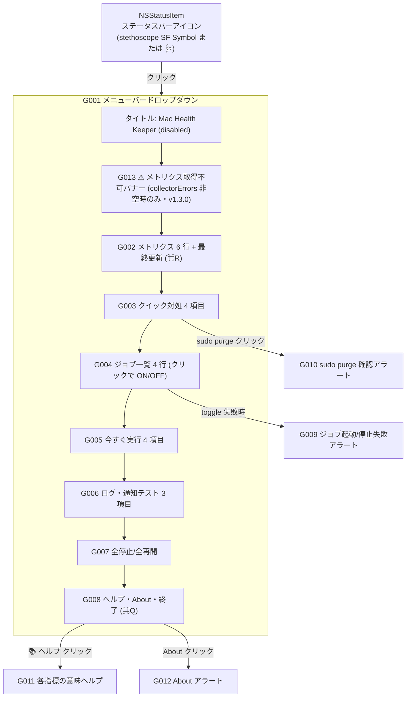

このドキュメントは、Mac Health Keeper の画面設計（メニューバー UI の構造・項目・操作・アラート）を定義します。
システム仕様書作成ルールは [`.agents/DOCS_RULES.md`](../../.agents/DOCS_RULES.md) を参照してください。
Mermaid 図作成時は [`.workflow/templates/AGENTS_MERMAID_RULES.md`](../../.workflow/templates/AGENTS_MERMAID_RULES.md) を参照してください。

> 本ドキュメントは「生きているドキュメント」です。実装変更時に更新し、レビュー結果は [`docs/00_review/`](../00_review/) に記録します。

# 2. 画面設計

Mac Health Keeper は **メニューバー常駐アプリ**（`LSUIElement=true`）であり、Dock アイコンや独立ウィンドウを持ちません。UI は次の 3 要素に閉じます。

1. **ステータスバーアイコン**（`NSStatusItem`）
2. **ドロップダウン NSMenu**（クリックで展開）
3. **モーダルアラート**（`NSAlert`・限定的に使用）

画面 ID は **G** プレフィックス（[99 ID 命名規則と管理](../99_ID命名規則と管理/README.md) を参照）。

---

## 2.1. 画面構成図（メニュー全体）

メニューバーアイコンをクリックすると以下のセクション順に NSMenu が展開されます（`MenuModel.build` の生成順）。

> 全項目の文言・絵文字・keyEquivalent・isEnabled・action は `Sources/MacHealthKit/MenuModel.swift` の `headerSpecs` / **`errorBannerSpecs`**（v1.3.0 追加・`MetricsSnapshot.collectorErrors` 非空時のみ出力）/ `metricsSpecs` / `quickActionSpecs` / `jobListSpecs` / `runJobSpecs` / `logSpecs` / `bulkSpecs` / `footerSpecs` と完全一致します。

---

## 2.2. ステータスバーアイコン

| 項目 | 内容 |
| ---- | ---- |
| 種別 | `NSStatusBar.system.statusItem(withLength: .variableLength)` |
| アイコン候補（優先順） | `stethoscope` → `heart.text.square` → `cross.case.fill` → `waveform.path.ecg` → `heart.fill`（最初に取得できた SF Symbol を採用） |
| フォールバック | SF Symbol が一つも取得できない場合のみ `🩺` を `button.title` に設定 |
| 構成 | `NSImage.SymbolConfiguration(pointSize: 15, weight: .regular)` を適用（macOS 11.0 以上）。`isTemplate=true` でテンプレート画像化（ダーク／ライト両対応）。 |
| 一次情報 | `src/MacHealth.swift::setStatusIcon` |

---

## 2.3. G001 メニュー（NSMenu の全項目）

順番・文言・isEnabled・action・keyEquivalent・representedJob・tooltip は `MenuModel` の出力と一致させます。

### G013 ⚠ メトリクス取得不可バナー（条件付き表示・v1.3.0）

`errorBannerSpecs(_:)`（`MenuModel.swift`）が、`MetricsSnapshot.collectorErrors` が空でない場合に限り、`headerSpecs()` の直後・`metricsSpecs()` の直前に挿入する。

| # | 行（書式） | 例 | 由来 |
| - | ---------- | -- | ---- |
| 1 | `⚠ メトリクス取得不可: ./install.sh を再実行してください`（disabled） | 同左（固定リテラル・補間値なし） | `MetricsSnapshot.collectorErrors` 非空 |
| 2 | セパレータ | — | 同上 |

- 文言は **固定リテラル**で、補間値・ユーザー入力を含まない（注入面なし）。
- 詳細（不在パス）は stderr 側に 1 回だけ出力される（`MetricsCollectorPolicy.missingScriptStderrLine`）。メニュー側は短文のみ。
- `collectorErrors` が空（既定状態）の場合は **既存の v1.2.0 メニュー出力と完全一致**（後方互換）。
- 由来となるエラー検知は `MetricsCollectorPolicy.decide`（[03 アーキテクチャ §3.6.1](../01_システム概要/03_アーキテクチャ/README.md#361-クラス図domain--infra-の主要型) のクラス図）の判定結果が `MetricsCollector` 経由で `MetricsSnapshot.collectorErrors` に積まれることによる。
- 一次情報: `Sources/MacHealthKit/MenuModel.swift::errorBannerSpecs(_:)` / `Sources/MacHealthKit/MetricsCollectorPolicy.swift` / `src/MetricsCollector.swift::collect()`。

### G002 メトリクス（disabled 表示行 + 最終更新行）

`metricsSpecs(snapshot:, calendar:)`（`MenuModel.swift`）が生成する 6 行 + 1 行。

| # | 行（書式） | 例 | 由来 |
| - | ---------- | -- | ---- |
| 1 | `稼働時間:       <days>日 <hours>時間` | `稼働時間:       12日 7時間` | `MetricsSnapshot.uptimeDays`/`uptimeHours` |
| 2 | `負荷平均(1分):  <loadAvg>` | `負荷平均(1分):  2.3` | `MetricsSnapshot.loadAvg` |
| 3 | `空きメモリ:     <memoryFreePct>%` | `空きメモリ:     43%` | `MetricsSnapshot.memoryFreePct` |
| 4 | `圧縮メモリ:     <compressedGB>` | `圧縮メモリ:     6.2 GB` | `MetricsSnapshot.compressedGB` |
| 5 | `スワップ使用:   <swapUsed>` | `スワップ使用:   512M` | `MetricsSnapshot.swapUsed` |
| 6 | `<dockerLine>`（`Docker:         起動中（コンテナ: N）` または `Docker:         停止中`） | `Docker:         起動中（コンテナ: 3）` | `MetricsSnapshot.dockerLine` |
| 7 | `最終更新: HH:mm:ss  (⌘R で更新)` または 初回起動時のみ `取得中…` | `最終更新: 14:32:01  (⌘R で更新)` | `MetricsSnapshot.lastUpdated`／`.distantPast` |

- 最終更新行のみ `MenuAction.refreshNow` の **アクション項目**（`keyEquivalent="r"`、`isEnabled=true`）。他は `.disabled`（クリック不可）。
- 取得中（`.distantPast`）の場合は disabled の `取得中…` を表示する。

### G003 クイック対処（4 項目）

`quickActionSpecs()`。

| 項目 | 表示 | action | 動作 |
| ---- | ---- | ------ | ---- |
| 見出し | `クイック対処`（disabled） | — | — |
| App Refresh | `🌀 重いアプリを今すぐリフレッシュ` | `quickAppRefresh` | `mac-health run refresh` を起動し、`notify("🌀 重いアプリのリフレッシュを開始しました")`。 |
| sudo purge | `🧹 ファイルキャッシュ解放 (sudo purge)` | `quickPurge` | **G010 確認アラートを表示**し、許可されたら Terminal を `activate` → `do script "sudo purge && echo ..."`。 |
| memory_pressure | `📉 メモリ圧迫テスト (解放を促す)` | `quickMemoryPressure` | `/usr/bin/memory_pressure -l warn` を起動し、`notify("📉 メモリ圧迫テストを実行しました")`。 |
| Docker Quit | `🐳 Docker Desktop を Quit` | `quickDockerQuit` | `osascript -e 'quit app "Docker Desktop"'`、`notify("🐳 Docker Desktop を Quit しました")`、3 秒後にメトリクス更新。 |

### G004 ジョブ一覧（4 行・クリックで ON/OFF）

`jobListSpecs(snapshot:, catalog:, timing:, now:, calendar:)`。

| 項目 | 表示書式 | tooltip | action |
| ---- | -------- | ------- | ------ |
| 見出し | `ジョブ（クリックで ON/OFF を切替）`（disabled） | — | — |
| ジョブ行 × 4 | `<icon>  <shortName>    <extras>` 例: `🟢  メモリ／負荷監視    5分毎 ・ 最終 3分前` | `ラベル: com.github.adachi-tatsuru.machealth.<job>` + 任意で `最終実行: yyyy/MM/dd HH:mm:ss` / `次回実行: yyyy/MM/dd HH:mm`（複数行） | `toggleJob`（`representedObject=<job>`） |

`icon`: `loaded=true → 🟢` / `false → ⚪`。

`extras`: 配列 `[freq, "最終 X" or "次回 X" or "未実行"]` を ` ・ ` で結合（`MenuModel.swift::jobListSpecs`）。

- `ScheduleKind.interval(_)` のジョブ（monitor / docker）: `status.lastRun` があれば `最終 <relativeTimeShort>`、無くて loaded なら `未実行`。
- `ScheduleKind.daily(_,_)` のジョブ（uptime / refresh）: loaded かつ `status.nextRun` があれば `次回 <relativeNext>`。

### G005 今すぐ実行（4 項目）

`runJobSpecs(catalog:)`。

| 項目 | 表示 | action |
| ---- | ---- | ------ |
| 見出し | `今すぐ実行`（disabled） | — |
| 各ジョブ × 4 | `  ▶ <shortName>` | `runJob`（`representedObject=<job>`） |

クリックで `mac-health run <job>` を起動し、戻ってからメトリクスを再収集。

### G006 ログ・通知テスト（3 項目）

`logSpecs()`。

| 項目 | 表示 | keyEquivalent | action | 動作 |
| ---- | ---- | ------------- | ------ | ---- |
| 通知履歴 | `通知履歴を開く` | `e` | `openEventsLog` | `touch <logDir>/events.log` → `open -a Console <logDir>/events.log` の **2 段引数配列起動**（`&&` シェル連結を排除）。 |
| 監視ログ | `監視ログを開く` | `m` | `openMonitorLog` | 同上で `<logDir>/monitor.log` を開く。 |
| 通知テスト | `通知テスト` | `t` | `testNotification` | `mac-health test` を起動（通知センターに `🧪 Mac Health: Test` / `通知が届けば OK` が表示される）。 |

### G007 全停止・全再開（2 項目）

`bulkSpecs()`。

| 項目 | 表示 | action | 動作 |
| ---- | ---- | ------ | ---- |
| 全停止 | `全ジョブを停止` | `pauseAllJobs` | `JobController.disableAll()` → `mac-health disable`（4 ジョブ bootout）。表示はオプティミスティック更新後に再収集で実態反映。 |
| 全再開 | `全ジョブを再開` | `resumeAllJobs` | `JobController.enableAll()` → `mac-health enable`（4 ジョブ bootstrap）。 |

### G008 フッター（ヘルプ・About・終了）

`footerSpecs()`。

| 項目 | 表示 | keyEquivalent | action |
| ---- | ---- | ------------- | ------ |
| ヘルプ | `📚 各指標の意味…` | — | `showMetricsHelp` → **G011 ヘルプアラート** |
| About | `このアプリについて…` | — | `showAbout` → **G012 About アラート** |
| 終了 | `Mac Health を終了` | `q` | `terminate`（`NSApplication.terminate(_:)`・target は responder chain） |

---

## 2.4. アラート画面

### G009 ジョブ起動／停止失敗アラート

| 項目 | 内容 |
| ---- | ---- |
| 発生条件 | `toggleJob` 後 0.7 秒待機で `isLoaded` 再取得し、状態が変わっていなかった場合（`actualLoaded == wasLoaded`）。 |
| messageText | `ジョブの<action>に失敗しました`（action = "起動" または "停止"） |
| informativeText | `「<shortName>」の<action>を試みましたが、状態が変わりませんでした。\n\n<trimmed launchctl 出力>` |
| alertStyle | `.warning` |
| ボタン | `OK` |
| 一次情報 | `src/MacHealth.swift::toggleJob` |

### G010 sudo purge 確認アラート

| 項目 | 内容 |
| ---- | ---- |
| 発生条件 | `quickPurge` 選択時に必ず表示 |
| messageText | `sudo purge を実行しますか？` |
| informativeText | `ファイルシステムキャッシュを解放します。\nターミナルが開いてパスワードを聞かれます。` |
| ボタン | `ターミナルで実行` / `キャンセル` |
| 実行時の動作 | `osascript -e "tell application \"Terminal\" to activate" -e "tell application \"Terminal\" to do script \"sudo purge && echo …\""`。**`-e` は引数配列の独立要素として渡される**（シェル再パース排除）。 |
| 一次情報 | `src/MacHealth.swift::quickPurge` |

### G011 各指標の意味ヘルプアラート

| 項目 | 内容 |
| ---- | ---- |
| 発生条件 | `showMetricsHelp` |
| messageText | `各指標の意味と見方` |
| informativeText | `src/MacHealth.swift::showMetricsHelp` のヘルパ本文（重要度の高い順：★★★ 空きメモリ％ / ★★★ メモリプレッシャー / ★★ 圧縮メモリ / ★ 負荷平均 / ★ スワップ使用、ジョブ表示の見方、スワップ改善の効果順）。 |
| alertStyle | `.informational` |
| ボタン | `OK` |

### G012 About アラート

| 項目 | 内容 |
| ---- | ---- |
| 発生条件 | `showAbout` |
| messageText | `Mac Health Keeper` |
| informativeText | `再起動なしで再起動相当の状態を保つ\n自動メンテナンスシステム\n\n• メモリ／負荷監視（5分毎）\n• Dockerアイドル監視（10分毎）\n• 長期稼働の通知（毎日 9:00）\n• アプリ自動再起動（毎日 3:00）\n\nバージョン <CFBundleShortVersionString 動的取得値>`（`Bundle.main.infoDictionary["CFBundleShortVersionString"]` から `formatAboutVersionLine(_:)` 経由で動的取得。取得失敗時は `バージョン 不明` にフォールバック） |
| alertStyle | `.informational` |
| ボタン | `OK` |

---

## 2.5. キーボードショートカット（メニュー展開時）

| 項目 | キー | action |
| ---- | ---- | ------ |
| 最終更新行 | `⌘R` | `refreshNow` |
| 通知履歴を開く | `⌘E` | `openEventsLog` |
| 監視ログを開く | `⌘M` | `openMonitorLog` |
| 通知テスト | `⌘T` | `testNotification` |
| Mac Health を終了 | `⌘Q` | `terminate`（responder chain → `NSApplication.terminate(_:)`） |

> `keyEquivalent` は `MenuItemSpec` 経由で NSMenuItem に設定。Cocoa の標準 modifier は `⌘`。

---

## 2.6. 自動更新タイミング

| 契機 | 動作 |
| ---- | ---- |
| アプリ起動時 | `applicationDidFinishLaunching` → `setStatusIcon` → `rebuildMenu` → `refreshMetricsAsync` |
| 60 秒毎 | `Timer.scheduledTimer(withTimeInterval: 60.0, repeats: true)` で `refreshMetricsAsync` |
| ユーザー操作 | `refreshNow`（⌘R）、`runJob` 完了後、`quickAppRefresh` / `quickMemoryPressure` / `quickDockerQuit`（後者は 3 秒遅延）後、`toggleJob` / `pauseAllJobs` / `resumeAllJobs` 後 |

メトリクス取得は `metricsQueue = DispatchQueue(label: "MacHealth.metrics", qos: .background)` で非同期実行し、結果は `DispatchQueue.main.async` でキャッシュ反映 → `rebuildMenu`。

---

## 参考資料

- [03 アーキテクチャ](../01_システム概要/03_アーキテクチャ/README.md) — UI / Domain / Infra 境界
- [04 機能設計](../04_機能設計/README.md) — 各クイック対処・ジョブ ON/OFF の処理フロー
- [99 ID 命名規則と管理](../99_ID命名規則と管理/README.md)
- 一次情報: `Sources/MacHealthKit/MenuModel.swift`・`src/MenuBuilder.swift`・`src/MacHealth.swift`

---

**最終更新**: 2026 年 05 月 29 日 / **maintainer**: docs worker
