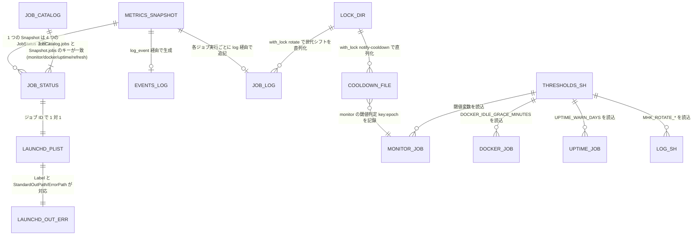
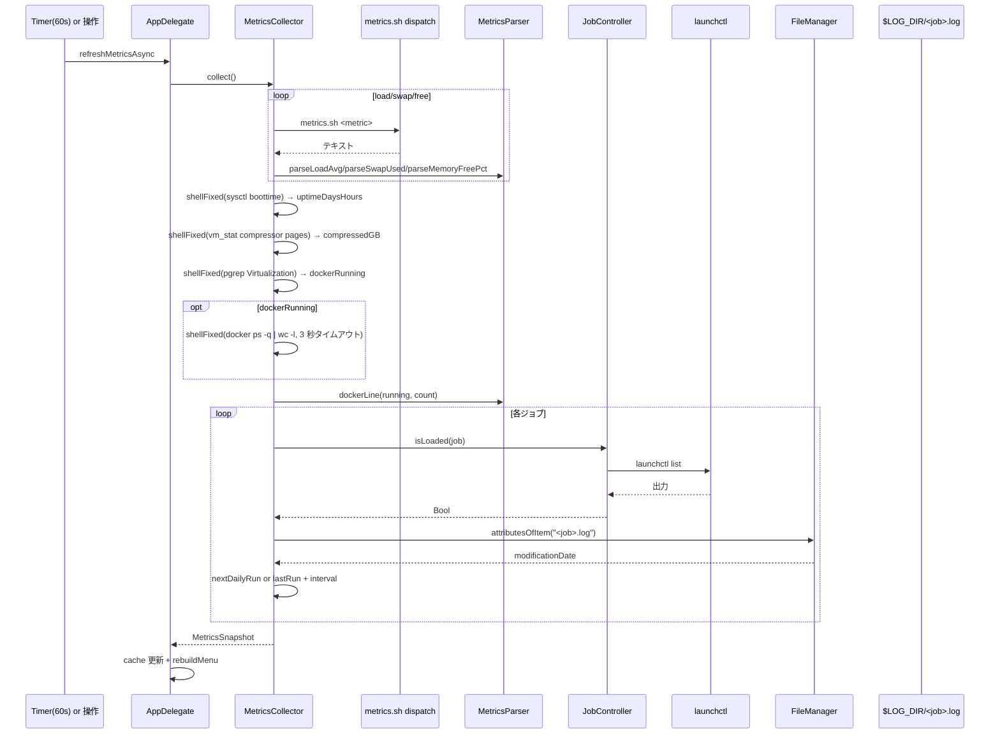

このドキュメントは、Mac Health Keeper のデータ設計（値型・ファイル形式・launchd plist スキーマ・設定値・ロックファイル）を定義します。
システム仕様書作成ルールは [`.agents/DOCS_RULES.md`](../../.agents/DOCS_RULES.md) を参照してください。
Mermaid 図作成時は [`.workflow/templates/AGENTS_MERMAID_RULES.md`](../../.workflow/templates/AGENTS_MERMAID_RULES.md) を参照してください。

> 本ドキュメントは「生きているドキュメント」です。実装変更時に更新し、レビュー結果は [`docs/00_review/`](../00_review/) に記録します。

# 3. データ設計

Mac Health Keeper はリレーショナル DB を持たず、データは **Swift 値型（in-memory）**・**プレーンテキストログ**・**plist**・**シェル設定スクリプト**・**ロックディレクトリ** の 5 形態で扱います。

---

## 3.1. データの関係（ER 図相当）



---

## 3.2. Swift 値型（in-memory データ）

すべて `Sources/MacHealthKit/` の `public struct` / `public enum`。AppKit 非依存・テスト対象。

### 3.2.1. T01: `MetricsSnapshot`（`Metrics.swift`）

| No | フィールド | 型 | 既定値 | 内容 |
| -- | ---------- | -- | ------ | ---- |
| 1 | `uptimeDays` | `Int` | `0` | 起動日数（`(now - boot) / 86400`） |
| 2 | `uptimeHours` | `Int` | `0` | 起動時間端数（`(now - boot) % 86400 / 3600`） |
| 3 | `loadAvg` | `String` | `"—"` | Load Average 1 分。trim 後空なら `"—"` |
| 4 | `memoryFreePct` | `String` | `"—"` | 空きメモリ％（`memory_pressure` の `memory free percentage`） |
| 5 | `compressedGB` | `String` | `"—"` | 圧縮メモリ（`vm_stat` Pages occupied by compressor × 4096 ÷ 1024³ を `%.1f GB`） |
| 6 | `swapUsed` | `String` | `"—"` | スワップ使用（`sysctl vm.swapusage` の `used = N M` の N M） |
| 7 | `dockerLine` | `String` | `"—"` | Docker 行（起動中なら `Docker:         起動中（コンテナ: <n>）`、停止中なら `Docker:         停止中`） |
| 8 | `jobs` | `[String: JobStatus]` | `[:]` | キーはジョブ ID（`JobCatalog.jobs` と一致）。 |
| 9 | `lastUpdated` | `Date` | `.distantPast` | 最終更新時刻。`.distantPast` は「取得中」 |
| 10 | `collectorErrors` | `[String]` | `[]` | v1.3.0 追加（非破壊フィールド追加）。`MetricsCollector` が `MetricsCollectorPolicy.decide` 経由で「収集経路の不整合」（例: `metrics.sh` 未配置）を検知した際の警告メッセージ列。`MenuModel.errorBannerSpecs(_:)` が空でない場合に警告バナー（G013）を生成する。 |

```swift
public struct MetricsSnapshot: Equatable {
    public var uptimeDays: Int
    public var uptimeHours: Int
    public var loadAvg: String
    public var memoryFreePct: String
    public var compressedGB: String
    public var swapUsed: String
    public var dockerLine: String
    public var jobs: [String: JobStatus]
    public var lastUpdated: Date
    public var collectorErrors: [String]   // v1.3.0 追加・既定 []
}
```

### 3.2.2. T02: `JobStatus`（`Metrics.swift`）

| No | フィールド | 型 | 既定値 | 内容 |
| -- | ---------- | -- | ------ | ---- |
| 1 | `loaded` | `Bool` | `false` | `launchctl list` 出力に Label を含む非空行があるか |
| 2 | `lastRun` | `Date?` | `nil` | `<logDir>/<job>.log` の `modificationDate` |
| 3 | `nextRun` | `Date?` | `nil` | `interval(sec)` は `lastRun + sec`、`daily(h,m)` は `ScheduleTiming.nextDailyRun` |

### 3.2.3. T03: `ScheduleKind`（`JobCatalog.swift`）

```swift
public enum ScheduleKind: Equatable {
    case interval(Int)        // 秒
    case daily(Int, Int)      // hour, minute
}
```

| ジョブ | 値 |
| ------ | -- |
| `monitor` | `.interval(300)` |
| `docker` | `.interval(600)` |
| `uptime` | `.daily(9, 0)` |
| `refresh` | `.daily(3, 0)` |

### 3.2.4. T04: `MenuItemSpec` / `MenuAction`（`MenuModel.swift`）

```swift
public struct MenuItemSpec: Equatable {
    public enum Kind: Equatable { case item, disabled, separator }
    public var kind: Kind
    public var title: String
    public var isEnabled: Bool
    public var action: MenuAction?
    public var keyEquivalent: String
    public var representedJob: String?
    public var tooltip: String?
}

public enum MenuAction: Equatable {
    case refreshNow, quickAppRefresh, quickPurge, quickMemoryPressure, quickDockerQuit
    case toggleJob, runJob
    case openEventsLog, openMonitorLog, testNotification
    case pauseAllJobs, resumeAllJobs, showMetricsHelp, showAbout, terminate
}
```

`MenuBuilder.swift` の `selector(for:)` が `MenuAction → Selector` の 1 対 1 マップ（`refreshNow → #selector(AppDelegate.refreshNow)`、…、`terminate → #selector(NSApplication.terminate(_:))`）。

### 3.2.5. T05: `JobCatalog`（`JobCatalog.swift`）

| プロパティ | 型 | 値 |
| ---------- | -- | -- |
| `jobs` | `[String]` | `["monitor", "docker", "uptime", "refresh"]` |
| `shortNames` | `[String: String]` | `{monitor: "メモリ／負荷監視", docker: "Dockerアイドル監視", uptime: "長期稼働の通知", refresh: "アプリ自動再起動"}` |
| `frequencies` | `[String: String]` | `{monitor: "5分毎", docker: "10分毎", uptime: "毎日 9:00", refresh: "毎日 3:00"}` |
| `schedules` | `[String: ScheduleKind]` | §3.2.3 と同値 |
| `label(for:)` | `(String) -> String` | `"com.github.adachi-tatsuru.machealth.\(job)"` |

---

## 3.3. ファイル形式（永続データ）

すべて `$HOME/Library/Logs/MacHealth/` 配下。`scripts/lib/log.sh` の `LOG_DIR=$HOME/Library/Logs/MacHealth` で確定。

### 3.3.1. T06: `events.log`（通知履歴）

- 書式: `[YYYY-MM-DD HH:MM:SS] [LEVEL] [job] message`
- LEVEL: `INFO` / `WARN` / `ACTION` のいずれか（[05 エラー処理と外部通知](../05_エラー処理と外部通知/README.md) 参照）。
- 例:
  ```
  [2026-05-28 11:21:37] [WARN] [monitor] swap usage 5120MB exceeded threshold 5000MB
  [2026-05-28 11:25:00] [ACTION] [docker] auto-quit Docker Desktop (idle 35 min, off-hours)
  [2026-05-28 03:00:42] [INFO] [refresh] AppRefresh completed: refreshed=4 skipped=1
  ```
- 追記: `scripts/lib/log.sh::log_event "$JOB" "$LEVEL" "$msg"`（`echo "[$ts] [$level] [$job] $*" >> events.log`）。

### 3.3.2. T07: `<job>.log`（各ジョブの実行ログ）

- ファイル名: `monitor.log` / `docker.log` / `uptime.log` / `refresh.log`。
- 書式: `[YYYY-MM-DD HH:MM:SS] message`（LEVEL なし）。
- 例（`monitor.log`）:
  ```
  [2026-05-28 11:20:00] swap=512MB compressed=6.2GB load1m=2.3 cores=8 pressure=normal
  [2026-05-28 11:25:00] swap=5120MB compressed=10.5GB load1m=4.1 cores=8 pressure=warn
  ```
- 追記: `log "$JOB" "$msg"`（`echo "[$ts] $*" >> $LOG_DIR/$job.log`）。
- `MetricsCollector.collect` が `modificationDate` を `JobStatus.lastRun` として使用する。
- ローテート対象（拡張子 `log`・既定 5 MB / 3 世代）。

### 3.3.3. T08: `<job>.log.<N>`（ローテート世代ファイル）

- 命名: `monitor.log.1` / `.2` / `.3`（`MHK_ROTATE_KEEP_GENERATIONS=3` 既定）。`.4` 以降は削除。
- 生成タイミング: 各ジョブ終了時に `trap finalize_job EXIT` → `rotate_logs` → 上限超過なら `rotate_file`。
- 通常ログ（`.log` 等）: `mv path path.1` → `touch path`（原子的）。
- launchd 出力（`.out` / `.err`）: launchd が fd を保持しているため `cp path path.1` → `: > path`（原子的 truncate）。

### 3.3.4. T09: `launchd.<job>.out` / `launchd.<job>.err`

- 書式: launchd の標準出力／エラーをそのまま記録。
- ファイル名: `launchd.monitor.{out,err}` / `launchd.docker.{out,err}` / `launchd.uptime.{out,err}` / `launchd.refresh.{out,err}`。
- 生成: launchd plist の `StandardOutPath` / `StandardErrorPath` の指定先（`{{HOME}}/Library/Logs/MacHealth/launchd.<job>.{out,err}`）。
- ローテート対象（拡張子 `out` / `err`・既定 5 MB / 3 世代）。

### 3.3.5. T10: `rotate.err`（ローテート失敗の専用ログ）

- 書式: `[YYYY-MM-DD HH:MM:SS] [ERROR] [rotate] <file>: <reason>`
- 例:
  ```
  [2026-05-28 03:00:42] [ERROR] [rotate] $HOME/Library/Logs/MacHealth/monitor.log.2: generation shift failed (mv .2 -> .3)
  [2026-05-28 03:00:42] [ERROR] [rotate] $HOME/Library/Logs/MacHealth/launchd.refresh.out: truncate failed
  ```
- 生成: `scripts/lib/log.sh::record_rotation_error`（stderr に出力 + `rotate.err` に追記。rotate.err 自体の書込失敗は無視）。

### 3.3.6. T11: `COOLDOWN_FILE`（通知クールダウン）

- ファイル: `monitor.sh` は `$LOG_DIR/.monitor-cooldown`、`check-docker.sh` は `$LOG_DIR/.docker-notify-cooldown`（ハードコード）。
- 書式（monitor）: 各行 `key:epoch`。`key` は `swap` / `compressed` / `load` / `pressure`。
  ```
  swap:1716873600
  compressed:1716873600
  load:1716873600
  pressure:1716877200
  ```
- 書式（docker）: 1 行で `epoch` のみ（key なし）。
- 更新: `should_notify <key>` が経過確認後に `with_lock notify-cooldown _should_notify_update` で **read-modify-write を直列化**（`grep -v "^$key:" | echo "$key:$now" >> tmp; mv tmp <file>`）。`docker` 側は単純な `echo "$now" > <file>`。
- 経過判定: `(now - last) >= NOTIFICATION_COOLDOWN_MIN * 60`（docker は 21600 = 6 時間ハードコード）。

### 3.3.7. T12: `.docker-state`（Docker アイドル開始時刻）

- ファイル: `$LOG_DIR/.docker-state`。
- 書式: 1 行で `epoch`（コンテナ 0 観測を開始した時刻）。
- 削除: Docker が停止または `container_count != 0` または `auto-quit` 後。
- 一次情報: `scripts/bin/check-docker.sh::STATE_FILE`。

### 3.3.8. T13: ロックファイル

- パス: `$LOG_DIR/.locks/<name>.lock`（mkdir で作成、rmdir で解放）。
- 用途: ① `rotate`（`rotate_file` の世代シフトを直列化）／② `notify-cooldown`（`should_notify` の read-modify-write を直列化）。
- 取得失敗時はベストエフォートでロックなし継続し `record_rotation_error` に `"<name>.lock: lock acquisition failed; proceeding without lock"` を記録（`scripts/lib/lock.sh::with_lock`）。
- リトライ秒数: `MHK_LOCK_TIMEOUT_SEC=5`（既定）。

---

## 3.4. launchd plist スキーマ

`launchagents/com.github.adachi-tatsuru.machealth.<job>.plist.template` の構造（`{{HOME}}` は `install.sh` で `$HOME` に展開）。

| キー | 型 | 内容 |
| ---- | -- | ---- |
| `Label` | string | `com.github.adachi-tatsuru.machealth.<job>`（`JobCatalog.label(for:)` と一致） |
| `ProgramArguments` | array of string | 1 要素: `{{HOME}}/.local/bin/mac-health/bin/<script>.sh` |
| `StartInterval` | integer | monitor=`300` / docker=`600`（uptime / refresh では未使用） |
| `StartCalendarInterval` | dict | uptime=`{Hour: 9, Minute: 0}` / refresh=`{Hour: 3, Minute: 0}` |
| `RunAtLoad` | boolean | monitor=`true` / docker・uptime・refresh=`false` |
| `StandardOutPath` | string | `{{HOME}}/Library/Logs/MacHealth/launchd.<job>.out` |
| `StandardErrorPath` | string | `{{HOME}}/Library/Logs/MacHealth/launchd.<job>.err` |

### 3.4.1. 4 ジョブの実値一覧

| ジョブ | Label | ProgramArguments | スケジュール | RunAtLoad | StandardOutPath | StandardErrorPath |
| ------ | ----- | ---------------- | ------------ | --------- | --------------- | ----------------- |
| `monitor` | `com.github.adachi-tatsuru.machealth.monitor` | `{{HOME}}/.local/bin/mac-health/bin/monitor.sh` | `StartInterval=300` | `true` | `launchd.monitor.out` | `launchd.monitor.err` |
| `docker` | `com.github.adachi-tatsuru.machealth.docker` | `…/check-docker.sh` | `StartInterval=600` | `false` | `launchd.docker.out` | `launchd.docker.err` |
| `uptime` | `com.github.adachi-tatsuru.machealth.uptime` | `…/check-uptime.sh` | `StartCalendarInterval Hour=9 Minute=0` | `false` | `launchd.uptime.out` | `launchd.uptime.err` |
| `refresh` | `com.github.adachi-tatsuru.machealth.refresh` | `…/refresh.sh` | `StartCalendarInterval Hour=3 Minute=0` | `false` | `launchd.refresh.out` | `launchd.refresh.err` |

> 上表は **`launchagents/*.plist.template` の実物と `Sources/MacHealthKit/JobCatalog.swift` の `schedules` を突合済み**。

---

## 3.5. 設定値（`scripts/config/thresholds.sh`）

すべて編集可能・各ジョブ／log.sh が source して参照。

| 変数 | 既定値 | 単位 | 参照箇所 |
| ---- | ------ | ---- | -------- |
| `THRESHOLD_SWAP_USED_MB` | `5000` | MB | `monitor.sh`（スワップ蓄積警告） |
| `THRESHOLD_COMPRESSED_GB` | `10` | GB | `monitor.sh`（圧縮メモリ警告） |
| `THRESHOLD_LOAD_AVG_MULTIPLIER` | `10` | 倍率（× コア数） | `monitor.sh`（高負荷警告） |
| `DOCKER_IDLE_GRACE_MINUTES` | `30` | 分 | `check-docker.sh`（猶予） |
| `UPTIME_WARN_DAYS` | `30` | 日 | `check-uptime.sh`（長期稼働警告） |
| `NOTIFICATION_COOLDOWN_MIN` | `60` | 分 | `notification_cooldown.sh::should_notify` |
| `MHK_ROTATE_MAX_BYTES` | `5242880` | bytes（5 MB） | `log.sh::_rotate_max_bytes` |
| `MHK_ROTATE_KEEP_GENERATIONS` | `3` | 世代 | `log.sh::_rotate_keep_gens` |
| `MHK_ROTATE_EXTS` | `"log out err"` | 拡張子（スペース区切り） | `log.sh::_rotate_exts` |
| `MHK_LOCK_TIMEOUT_SEC` | `5` | 秒 | `lock.sh::acquire_lock` |

> docker のクールダウン（業務時間内通知）は 21600 秒（6 時間）でハードコード（`check-docker.sh` 内 `if [ $((now - last)) -ge 21600 ]`）。`thresholds.sh` で変更できないため変更時はソース修正が必要。

---

## 3.6. データフロー（収集 → 表示 → 永続化）



---

## 参考資料

- [03 アーキテクチャ](../01_システム概要/03_アーキテクチャ/README.md)
- [04 機能設計](../04_機能設計/README.md)
- [05 エラー処理と外部通知](../05_エラー処理と外部通知/README.md)
- [99 ID 命名規則と管理](../99_ID命名規則と管理/README.md)
- 一次情報: `Sources/MacHealthKit/Metrics.swift`・`JobCatalog.swift`・`MenuModel.swift`・`scripts/lib/{log,metrics,lock,notify}.sh`・`scripts/config/thresholds.sh`・`launchagents/*.plist.template`

---

**最終更新**: 2026 年 05 月 29 日 / **maintainer**: docs worker
