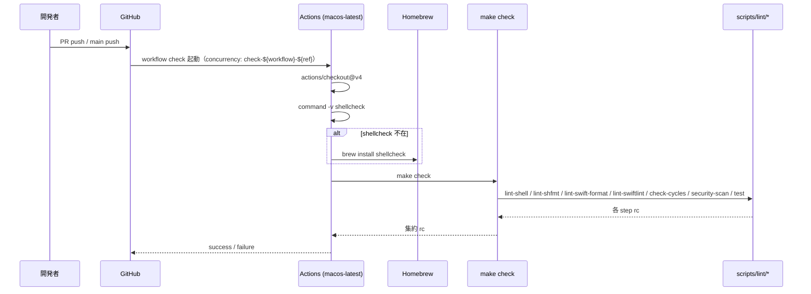
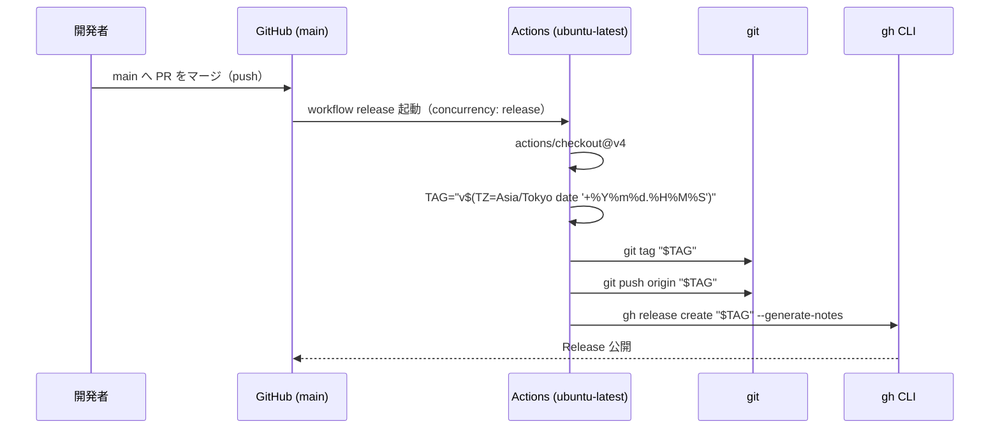

このドキュメントは、CI（PR / `main` push 時の `make check` 実行）と Release 自動化（`main` マージ時の JST 日時タグ + GitHub Release 作成）の設計を定義します。
システム仕様書作成ルールは [`.agents/DOCS_RULES.md`](../../../.agents/DOCS_RULES.md) を参照してください。

# CI・Release 自動化機能（F010）

## 概要

GitHub Actions 上で 2 つのワークフローを運用する：

1. **CI（`.github/workflows/check.yml`）**: PR と `main` push の双方を契機に、**macos-latest** runner で `make check`（[F009 ローカル検証](../ローカル検証/README.md)）を実行する。
2. **Release 自動化（`.github/workflows/create-release.yaml`）**: `main` への push を契機に、**ubuntu-latest** runner で **JST 日時ベースのタグ**を打ち、`gh release create --generate-notes` で GitHub Release を自動作成する。

> 配布物（`~/Applications/MacHealth.app` / `~/.local/bin/mac-health/`）には CI/Release のいずれも含まれない。エンドユーザーの利用には影響しない開発側の仕組みである。

## F010-S1: CI（`check.yml`）の処理フロー

### キー設定（`check.yml`）

| キー | 値 | 意図 |
| ---- | -- | ---- |
| `name` | `check` | UI 上の表示名 |
| `on` | `pull_request` / `push.branches: [main]` | PR と main の両方で起動 |
| `permissions.contents` | `read` | 最小権限（書込権限なし） |
| `concurrency.group` | `check-${{ github.workflow }}-${{ github.ref }}` | 同一 ref への多重起動をキャンセル |
| `concurrency.cancel-in-progress` | `true` | 古いジョブを中断（最新コミットのみ検証） |
| `runs-on` | `macos-latest` | `swift test` / shfmt / swift-format / swiftlint を macOS で実行できる runner |
| `timeout-minutes` | `30` | ハング防止 |

## F010-S2: Release 自動化（`create-release.yaml`）の処理フロー

### キー設定（`create-release.yaml`）

| キー | 値 | 意図 |
| ---- | -- | ---- |
| `name` | `Release 作成` | UI 上の表示名（日本語） |
| `on` | `push.branches: [main]` | `main` マージのみが契機 |
| `permissions.contents` | `write` | タグ push と Release 作成に必要 |
| `concurrency.group` | `release` | 全 release ジョブを直列化 |
| `concurrency.cancel-in-progress` | `false` | 進行中の Release を中断しない（タグ衝突防止） |
| `runs-on` | `ubuntu-latest` | `git` / `gh` のみで完結するため軽量 runner |
| `env.GH_TOKEN` | `${{ secrets.GITHUB_TOKEN }}` | `gh` の認証 |

### タグ形式

- 形式: `vYYYYMMDD.HHMMSS`（例: `v20260528.143000`）。
- 生成: `TZ=Asia/Tokyo date '+%Y%m%d.%H%M%S'`。**JST** 固定。
- 衝突: 1 秒以内に複数 push が発生した場合は `git push origin "$TAG"` が衝突して失敗する。`concurrency.group: release` で直列化しているため、現実的には発生しにくい。万一発生した場合は手動で `gh release create` を実行する運用とする。

### Release ノート

- `gh release create "$TAG" --generate-notes` を使い、コミット履歴から GitHub が自動生成する。
- リリースアセット（バイナリ）の添付は行わない。利用者は `git clone` → `./install.sh` で個別にビルドする（[01 プロジェクト概要 §1.6 配布形態](../../01_システム概要/01_プロジェクト概要/README.md#16-配布形態)）。

## 関係モジュール

| ファイル | 役割 |
| -------- | ---- |
| `.github/workflows/check.yml` | PR/`main` push 時の `make check` 実行（macos-latest）。 |
| `.github/workflows/create-release.yaml` | `main` push 時の JST 日時タグ + `gh release` 自動作成（ubuntu-latest）。 |
| `Makefile`（`check` ターゲット） | CI が呼ぶ集約エントリ。詳細は [F009 ローカル検証](../ローカル検証/README.md)。 |
| `scripts/lint/*` | CI 経由で実行されるランナー群。 |

## 関連テスト

- ワークフロー自体は GitHub 側の機能であり、ローカルから単体テストは行わない。
- 検証は **「PR 作成時に check ワークフローが成功する」「`main` マージ後に Release が公開されタグが付く」** という結果で確認する。

## バージョン stamp の責務分離

issue: 20260529_105524_ビルド時バージョン自動stamp（v1.3.0〜）で `CFBundleVersion` を git 由来値で自動 stamp する経路を追加した。CI 側は本変更で**何も変えていない**。設計上の責務分離は以下の通り。

| 経路 | 役割 | stamp 実行 |
| ---- | ---- | ---------- |
| `.github/workflows/create-release.yaml`（`ubuntu-latest`） | JST 日時タグ（`vYYYYMMDD.HHMMSS`）を push し `gh release create --generate-notes` で Release を公開する。`CFBundleVersion` には触れない。 | **しない** |
| `install.sh`（ローカル macOS） | `.app/Contents/Info.plist` を組み立てた直後に `bash "$REPO_DIR/scripts/lib/version_stamp.sh" "$APP_DIR/Contents/Info.plist" "$REPO_DIR"` を呼び、`git -C "$REPO_DIR" describe --tags --always` を `plutil -replace CFBundleVersion -string` で注入する。 | **する** |
| `Makefile`（`make build`） | `build/MacHealth` バイナリのみ生成し `.app` を作らないため、stamp 対象が存在しない。 | **しない** |

### CI で stamp しない理由

- `create-release.yaml` は **`ubuntu-latest` runner** で動作し、`plutil` が利用できない（`plutil` は macOS native）。仮に `apt install` 系で代替を入れる場合も plist 構造の取り扱いが煩雑になる。
- 本機能の配布形態は「`git clone` → `./install.sh`」のローカルビルドであり、`.app` を組み立てるのは常に macOS 上の `install.sh` 経路に限定される。CI は tag を打って Release を公開するだけで、`.app` の組立・配布を行わない（バイナリアセットも添付しない）。
- したがって CI 側で stamp する必要がなく、ローカル `install.sh` 経由でのみ `git describe --tags --always` の値を `CFBundleVersion` に注入する設計とする。

### CI fetch-depth について

- 本機能では CI 側で `git describe` を呼ばないため、`actions/checkout@v4` の既定 `fetch-depth: 1` のままで影響なし。
- 将来 CI 側で semver タグ抽出・stamp 等を行う場合は `fetch-depth: 0` を要設定（別 issue で対応する）。

## 既知の制約

- **CI runner の `shellcheck` 同梱状況**は時期によって変動する。`check.yml` は不在時に `brew install shellcheck` でフォールバックするが、Homebrew の障害時は CI 自体が失敗する。`brew` 障害は GitHub の status を確認して再 push する運用とする。
- **Release タグの衝突**: 1 秒以内の同時 merge では `git push origin "$TAG"` が衝突する可能性がある。`concurrency.group: release` で直列化しているため通常は発生しないが、衝突した場合は手動で次の秒のタグを切る。
- **`secrets.GITHUB_TOKEN`** で `gh release create` を行うため、フォーク PR からの Release 自動作成は許可していない（`on: push.branches: [main]` のみ）。
- **`make check` が macos-latest に依存**: shellcheck・swift・xcrun が必要。Linux runner では XCTest が動かないため CI ジョブは macos に固定する。
- **任意ツールの扱い**: CI 上で `shfmt` / `swift-format` / `swiftlint` を導入していない場合は SKIP となり、これらの差分は検出されない。導入を強制したくなったら `check.yml` の `Ensure shellcheck` ステップに `brew install shfmt swift-format swiftlint` を追加する（現状は SKIP 許容）。

---

## 参考資料

- [F009 ローカル検証](../ローカル検証/README.md)
- [`Makefile`](../../../Makefile)
- [`.github/workflows/check.yml`](../../../.github/workflows/check.yml)
- [`.github/workflows/create-release.yaml`](../../../.github/workflows/create-release.yaml)
- [03 アーキテクチャ §3.8.1.2 CI / §3.8.1.3 Release 自動化](../../01_システム概要/03_アーキテクチャ/README.md)
- 一次情報: `.github/workflows/{check.yml, create-release.yaml}`

---

**最終更新**: 2026 年 05 月 28 日 / **maintainer**: docs worker
