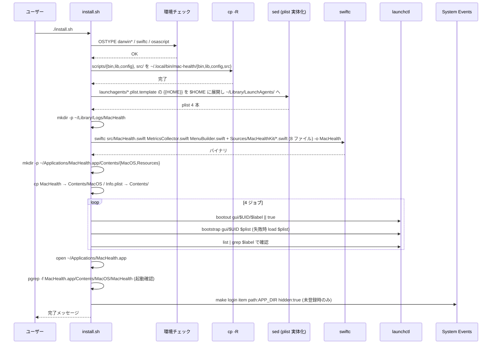
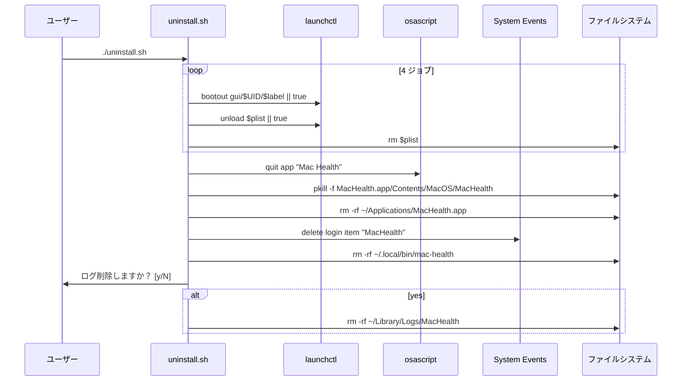

このドキュメントは、LaunchAgent 配備機能（install/uninstall）の設計を定義します。

# LaunchAgent 配備機能（F008）

## 概要

`install.sh` がアプリ・スクリプト・LaunchAgent plist を実環境へ配置し、`launchctl bootstrap` で 4 ジョブを `gui/<uid>` ドメインへ登録する。`uninstall.sh` は逆順に撤去する。

## install.sh の処理フロー

## uninstall.sh の処理フロー

## ビルド内訳（`install.sh` 内 `swiftc`）

`install.sh` 内で **1 モジュールとして** 以下 11 ファイルを `swiftc` に渡す（順序は実物どおり）。

| グループ | ファイル |
| -------- | -------- |
| UI（src/） | `MacHealth.swift` / `MetricsCollector.swift` / `MenuBuilder.swift` |
| Kit（Sources/MacHealthKit/） | `ScheduleTiming.swift` / `Metrics.swift` / `JobCatalog.swift` / `MetricsParser.swift` / `MenuModel.swift` / `ShellRunner.swift` / `AppleScriptEscaper.swift` / `JobController.swift` |

> `src/` の Swift ファイルでは `import MacHealthKit` は **不要**。`swiftc` ビルドでは src/Sources を 1 モジュールとしてまとめてコンパイルするため、型は同一モジュール内で解決される。

## 関係モジュール

| ファイル | 役割 |
| -------- | ---- |
| `install.sh` | 配備本体（環境チェック・コピー・plist 実体化・ビルド・bootstrap・ログイン項目）。 |
| `uninstall.sh` | 撤去本体（bootout・アプリ削除・ログイン項目削除・対話的ログ削除）。 |
| `launchagents/*.plist.template` | `{{HOME}}` プレースホルダ付き plist テンプレート。 |
| `src/Info.plist` | アプリの Info.plist（LSUIElement=true 等）。 |
| `Package.swift` | テスト用 SwiftPM 構成（配布ビルドでは使わない）。 |
| `Makefile` | テスト集約（配布には使わない）。 |

## 関連テスト

- `install.sh` / `uninstall.sh` は実環境変更を伴うため XCTest 対象外。手動検証で配備の動作を確認する（`launchctl list | grep machealth` / `open ~/Applications/MacHealth.app` 等）。

## 既知の制約

- `xcode-select --install` が完了していない環境では `swiftc` が無く `install.sh` の環境チェックで停止する。
- ログイン項目登録は `osascript` 経由のため、Automation 権限ダイアログが初回に表示される（macOS の TCC）。
- `bootstrap` に失敗した場合のフォールバックは `launchctl load`。これでも失敗するとそのジョブは `⚠️` で表示するが install 自体は継続する（部分的失敗を許容）。
- `~/Library/Logs/MacHealth/` を残したまま `uninstall.sh` 後に再 `install.sh` した場合、ローテート世代ファイル（`*.log.N`）が残る。意図的にクリーンインストールしたい場合は uninstall 時にログを削除する選択をする。

---

## 参考資料

- [03 アーキテクチャ §3.8 ビルド／配備フロー](../../01_システム概要/03_アーキテクチャ/README.md#38-ビルド--配備フロー)
- [03 データ設計 §3.4 launchd plist スキーマ](../../03_データ設計/README.md#34-launchd-plist-スキーマ)
- 一次情報: `install.sh`・`uninstall.sh`・`launchagents/*.plist.template`・`src/Info.plist`

---

**最終更新**: 2026 年 05 月 28 日 / **maintainer**: docs worker
