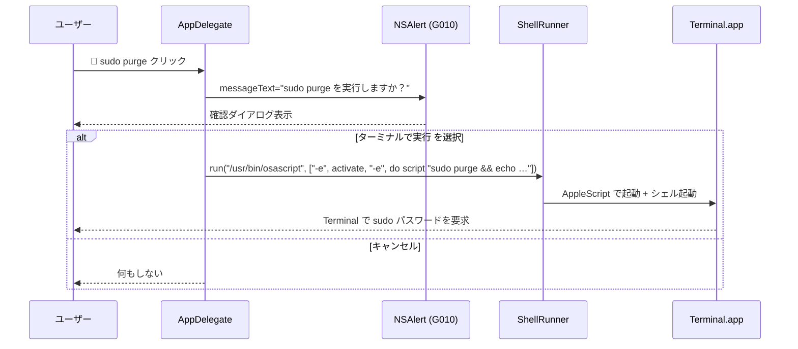
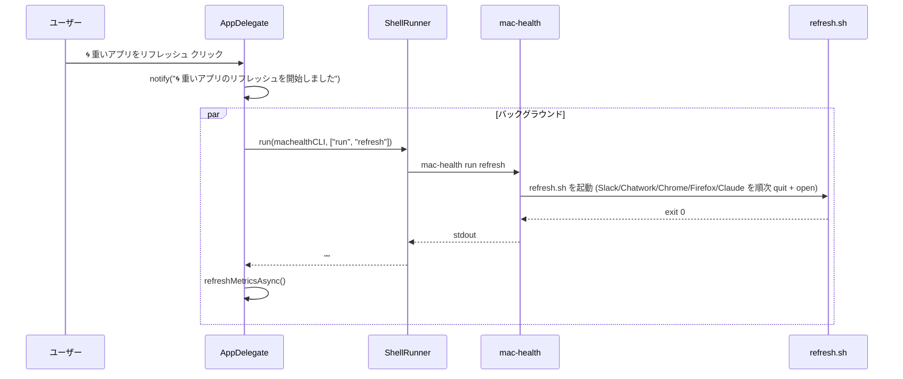

このドキュメントは、クイック対処機能（4 種）の設計を定義します。

# クイック対処機能（F004）

## 概要

メニューの「クイック対処」セクションから 1 クリックで実行する 4 つのアクション。すべて `ShellRunner.run(executable:args:)` の **引数配列** で起動し、`/bin/zsh -c "<文字列>"` でのシェル再パースを排除する（02 §3.5）。

## 入出力

| 項目 | 値 |
| ---- | -- |
| 入力 | メニュー項目クリック |
| 出力 | コマンド起動・通知センターへの通知 |
| 副作用 | 外部プロセス起動（`mac-health` / `/usr/bin/osascript` / `/usr/bin/memory_pressure`）、通知発行 |

## 4 アクションの仕様

| アクション | 起動コマンド（引数配列） | 通知 | 補足 |
| ---------- | ------------------------ | ---- | ---- |
| `quickAppRefresh` | `[machealthCLI, "run", "refresh"]` | `🌀 重いアプリのリフレッシュを開始しました` | 戻ってからメトリクス再収集。 |
| `quickPurge` | `[/usr/bin/osascript, "-e", "tell application \"Terminal\" to activate", "-e", "tell application \"Terminal\" to do script \"sudo purge && echo …\""]` | なし | G010 確認アラートで許可されたときのみ。複数 `-e` を **独立引数要素** に分解（シェル再パース排除）。 |
| `quickMemoryPressure` | `[/usr/bin/memory_pressure, "-l", "warn"]` | `📉 メモリ圧迫テストを実行しました` | 戻り値は無視（旧 `|| true` 相当）。 |
| `quickDockerQuit` | `[/usr/bin/osascript, "-e", "quit app \"Docker Desktop\""]` | `🐳 Docker Desktop を Quit しました` | 3 秒後にメトリクス再収集。 |

## 処理フロー（F004-S1: quickPurge の確認 → 実行）

## 処理フロー（F004-S2: quickAppRefresh）

## 関係モジュール

| ファイル | 役割 |
| -------- | ---- |
| `src/MacHealth.swift::quickAppRefresh/quickPurge/quickMemoryPressure/quickDockerQuit` | UI 配線とコマンド起動。 |
| `Sources/MacHealthKit/ShellRunner.swift` | `ZshShellRunner.run(executable:args:)`。 |
| `Sources/MacHealthKit/AppleScriptEscaper.swift::notificationArgs` | 通知文字列を argv 渡し（`notify(_:)` 経由）。 |
| `scripts/bin/refresh.sh` | App Refresh の実体（refresh CLI 経由）。 |

## 関連テスト

- `Tests/MacHealthKitTests/ZshShellRunnerInjectionTests.swift` — `; rm -rf x` 等を含む引数が単一引数として渡ること。
- `Tests/MacHealthKitTests/AppleScriptEscaperTests.swift` — argv 渡しの戻り値（executable + args の構造）と AppleScript リテラルエスケープの全域性。
- `Tests/MacHealthKitTests/LogOpenInvocationTests.swift` — `openLog` の touch → open 分割（クイック対処ではないが、引数配列起動の同方針）。

## 既知の制約

- `quickPurge` は Terminal.app を新規ウィンドウで開き、ユーザーに `sudo` パスワードを対話入力させる。GUI からの passwordless 化はしない（セキュリティ上の選択）。
- `quickDockerQuit` は Docker Desktop のグレースフル Quit に依存し、応答しなければ macOS の通常の Quit タイムアウトに従う。強制 kill は行わない。
- `quickMemoryPressure` の `-l warn` は macOS が「アプリにメモリ解放を促す」シグナルであり、必ず解放される保証はない。

---

## 参考資料

- [02 画面設計 §2.3 G003 / §2.4 G010](../../02_画面設計/README.md#g003-クイック対処4-項目)
- [05 エラー処理と外部通知](../../05_エラー処理と外部通知/README.md)
- 一次情報: `src/MacHealth.swift::quickAppRefresh/quickPurge/quickMemoryPressure/quickDockerQuit`

---

**最終更新**: 2026 年 05 月 28 日 / **maintainer**: docs worker
