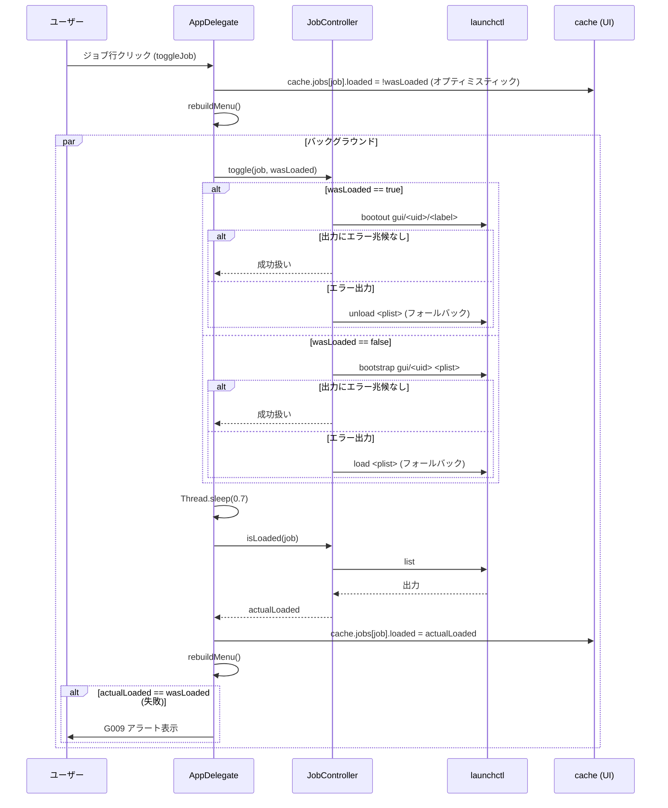
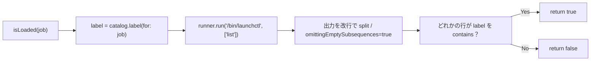

このドキュメントは、ジョブ ON/OFF 機能（CQRS）の設計を定義します。

# ジョブ ON/OFF 機能（F003・CQRS）

## 概要

- `JobController`（`Sources/MacHealthKit/JobController.swift`）が `launchctl` の **状態変更（Command）** と **状態取得（Query）** を分離する（CQRS）。
- Command: `load` / `unload` / `toggle` / `enableAll` / `disableAll`（bootstrap/bootout・mac-health enable/disable）。
- Query: `isLoaded`（`launchctl list` を読むだけで状態変更なし）。
- メニュー操作（個別 toggle）は **オプティミスティック更新** で UI を即時反映し、0.7 秒後に `isLoaded` で実態確認・乖離時にアラート。

## 入出力

| 項目 | 値 |
| ---- | -- |
| 入力 | ジョブ ID（`monitor`/`docker`/`uptime`/`refresh`）・`wasLoaded` Bool |
| 出力 | `launchctl` の stdout 文字列（成功時は通常空）/ Bool（`isLoaded`） |
| 副作用 | `launchctl bootstrap` / `bootout` / `load` / `unload` の実行、`mac-health enable` / `disable` の実行 |

## 処理フロー

### F003-S1: 個別 toggle（メニューの 🟢/⚪ クリック）

### F003-S2: isLoaded（Query・副作用なし）

- 02 §3.3 UC3: `grep '<label>'` のシェル補間を排除し、Swift 側でリテラル比較。
- 結果は従来の `grep -q` 非空判定と等価。

### F003-S3: 全停止／全再開

| アクション | 実行 |
| ---------- | ---- |
| `pauseAllJobs` | `disableAll()` → `mac-health disable`（4 ジョブを `launchctl bootout gui/$UID/<label>` 失敗時 `launchctl unload <plist>`） |
| `resumeAllJobs` | `enableAll()` → `mac-health enable`（4 ジョブを `launchctl bootstrap gui/$UID <plist>` 失敗時 `launchctl load <plist>`） |

両者ともオプティミスティック更新で UI を即時反映、0.7 秒後に `refreshMetricsAsync()` で実態を再収集する。

## 関係モジュール

| ファイル | 役割 |
| -------- | ---- |
| `Sources/MacHealthKit/JobController.swift` | CQRS の中核。`isLoaded` / `load` / `unload` / `toggle` / `enableAll` / `disableAll`・`bootstrapSucceeded`。 |
| `Sources/MacHealthKit/JobCatalog.swift` | label 規則 `com.github.adachi-tatsuru.machealth.<job>`。 |
| `Sources/MacHealthKit/ShellRunner.swift` | 引数配列で `launchctl` を起動。 |
| `src/MacHealth.swift::toggleJob/pauseAllJobs/resumeAllJobs` | UI 配線・オプティミスティック更新・アラート表示。 |
| `scripts/bin/mac-health` | `enable` / `disable` サブコマンドで一括処理。 |

## 関連テスト

- `Tests/MacHealthKitTests/JobControllerTests.swift` — 通常系の CQRS I/F。
- `Tests/MacHealthKitTests/JobControllerSafetyTests.swift` — フォールバック分岐・引数配列の確認。
- `Tests/MacHealthKitTests/SpyShellRunner.swift` — 呼出を捕捉するスパイ。

## 既知の制約

- `bootstrap` / `bootout` の成功判定は **stdout/stderr 統合出力の文字列マッチ**（`["error","failed","not permitted","no such","could not","invalid"]`）に依存する。新しい launchctl エラー文言が追加された場合は誤判定の可能性があるが、フォールバックの load/unload が二重に呼ばれても害は少ない。
- `isLoaded` は `launchctl list` の全出力を grep 相当で走査する。アクティブな launchd ジョブが多い環境でも性能影響は軽微（数百行〜数千行）。
- 個別 toggle の `Thread.sleep(0.7)` は launchd の bootstrap/bootout が反映されるまでの実機検証値で、環境次第ではアラート誤発火の可能性がある（その場合 UI を再操作すれば実態に追随する）。

---

## 参考資料

- [03 アーキテクチャ §3.3.3 CQRS](../../01_システム概要/03_アーキテクチャ/README.md#333-cqrscommand--query-分離)
- [03 データ設計 §3.4 launchd plist スキーマ](../../03_データ設計/README.md#34-launchd-plist-スキーマ)
- 一次情報: `Sources/MacHealthKit/JobController.swift`・`src/MacHealth.swift::toggleJob`

---

**最終更新**: 2026 年 05 月 28 日 / **maintainer**: docs worker
