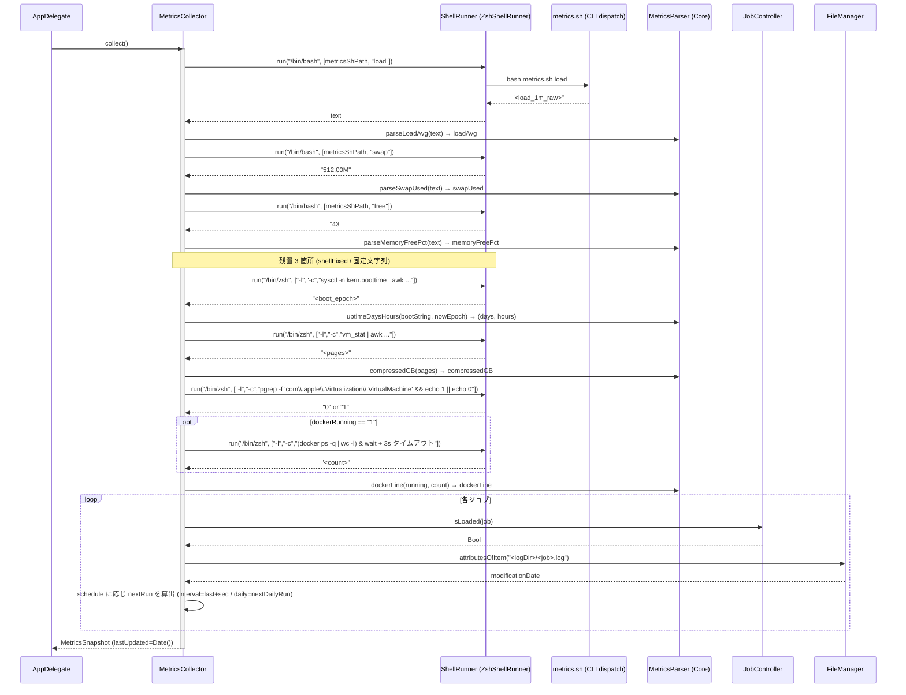

このドキュメントは、メトリクス収集機能の設計を定義します。

# メトリクス収集機能（F002）

## 概要

- `MetricsCollector`（Imperative Shell）が `metrics.sh <metric>` 引数呼び出しで主要メトリクスを取得し、`MetricsParser`（Functional Core）で純粋に値化する。
- 一部（boot epoch / compressor 生ページ / docker count）は `metrics.sh` の戻り値が算出済みのため、入力書式の互換性確保の観点から `/bin/zsh -l -c <固定文字列>` で残置している。残置文字列は固定リテラルでユーザー入力は流入しない（注入面なし）。

## 入出力

| 項目 | 値 |
| ---- | -- |
| 入力 | なし（タイマー / 操作トリガ） |
| 出力 | `MetricsSnapshot`（[03 データ設計 §3.2.1](../../03_データ設計/README.md#321-t01-metricssnapshotmetricsswift)） |
| 副作用 | `metrics.sh` / `/bin/zsh` の起動（読み取り専用コマンド）、`launchctl list`（`isLoaded` 経由）、ログファイル `modificationDate` 読取 |

## 処理フロー（F002-S1: collect() の主シーケンス）

## 関係モジュール

| ファイル | 役割 |
| -------- | ---- |
| `src/MetricsCollector.swift` | 調整役（Imperative Shell）。`metric(_:)` / `shellFixed(_:)` / `collect()`。 |
| `Sources/MacHealthKit/MetricsParser.swift` | 純粋パース（`parseLoadAvg` / `parseSwapUsed` / `parseMemoryFreePct` / `uptimeDaysHours` / `compressedGB` / `dockerLine`）。 |
| `Sources/MacHealthKit/ShellRunner.swift` | 引数配列で起動。シェル再パース排除。 |
| `Sources/MacHealthKit/JobController.swift` | `isLoaded(job:)` を提供（query）。 |
| `Sources/MacHealthKit/ScheduleTiming.swift` | `nextDailyRun(hour:minute:now:calendar:)` で次回実行時刻を算出。 |
| `scripts/lib/metrics.sh` | dispatch CLI（`load`/`swap`/`free`/`compressed`/`uptime_days`/`uptime_hours`/`docker`） + 純粋パース関数群 + 取得ラッパ。 |

## 関連テスト

- `Tests/MacHealthKitTests/MetricsParserTests.swift` — trim・丸め・"%.1f GB"・"—" フォールバック・dockerLine 書式の網羅。
- `Tests/MacHealthKitTests/ScheduleTimingTests.swift` — `nextDailyRun` の境界（当日／翌日繰上げ）・`relativeTimeShort` / `relativeNext`。
- `scripts/test/metrics.bats` / `metrics_test.sh` — `metrics_parse_*` / `metrics_uptime_*` の bats + 自前テスト。
- `Tests/MacHealthKitTests/ShellRunnerContractTests.swift` / `ZshShellRunnerInjectionTests.swift` — 引数配列契約と注入耐性。

## 既知の制約

- `metrics.sh` 経由 3 種（load / swap / free）は **既存 sed/awk 出力と完全一致** させるため、整形済みでない「生の抽出値」を返す（`metrics_parse_load_1m_raw` / `metrics_parse_swap_raw` / `metrics_parse_free_pct`）。
- 残置 3 箇所（boot/compressor/docker）は `MetricsParser` が「生の boot 文字列」「生ページ数」「コンテナ数文字列」を要求するため寄せると入力書式が変わる。注入面なし（固定リテラル）のため安全。
- Docker のコンテナ数取得は 3 秒タイムアウト（`docker ps -q & p=$!; (sleep 3; kill -9 $p) & wait $p`）。タイムアウト時は `?` を含む文字列となり `MetricsParser.dockerLine` が `?` に正規化。

---

## 参考資料

- [03 アーキテクチャ §3.3.5](../../01_システム概要/03_アーキテクチャ/README.md#335-データフロー)
- [03 データ設計](../../03_データ設計/README.md)
- 一次情報: `src/MetricsCollector.swift`・`Sources/MacHealthKit/MetricsParser.swift`・`scripts/lib/metrics.sh`

---

**最終更新**: 2026 年 05 月 28 日 / **maintainer**: docs worker
