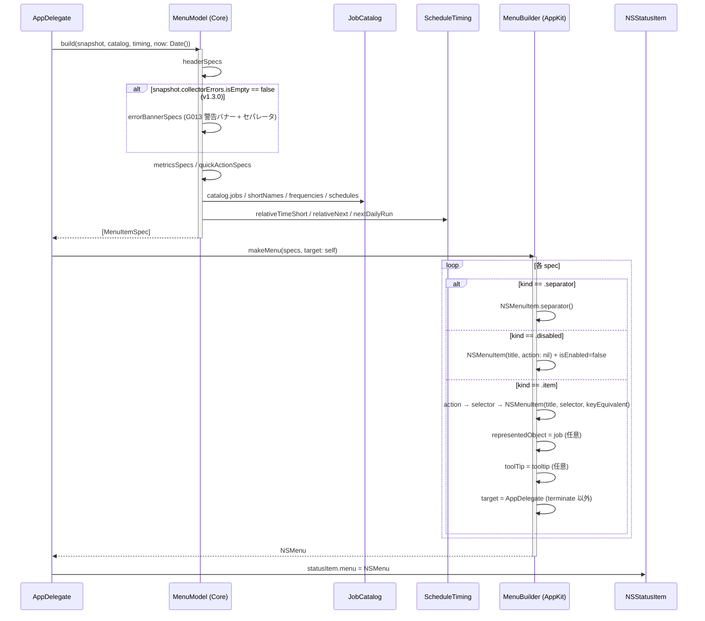

このドキュメントは、メニューバー表示機能の設計を定義します。

# メニューバー表示機能（F001）

## 概要

- メニューバーに常駐するステータスアイコンと NSMenu を構築・再描画する。
- データ生成（`MenuModel`・純粋）と AppKit 変換（`MenuBuilder`・薄い AppKit）を分離。
- `AppDelegate` は調整役のみで業務ロジックは持たない。

## 入出力

| 項目 | 値 |
| ---- | -- |
| 入力 | `MetricsSnapshot`（`cache`） / `JobCatalog` / `ScheduleTiming` / `Date()` |
| 出力 | `[MenuItemSpec]` → `NSMenu` → `NSStatusItem.menu` への割当 |
| 副作用 | NSStatusItem の image/title 設定、NSMenu の差し替え |

## 処理フロー（F001-S1: メニュー構築シーケンス）

## 関係モジュール

| ファイル | 役割 |
| -------- | ---- |
| `src/MacHealth.swift::AppDelegate.rebuildMenu` | 60 秒タイマー・ユーザー操作・metrics 取得完了で呼ばれる調整役 |
| `src/MacHealth.swift::AppDelegate.setStatusIcon` | SF Symbol 候補から最初に取得できたものを採用、フォールバック `🩺` |
| `Sources/MacHealthKit/MenuModel.swift` | `[MenuItemSpec]` 生成（純粋）。`MenuItemSpec` / `MenuAction` 定義。v1.3.0 で `errorBannerSpecs(_:)` を追加し、`MetricsSnapshot.collectorErrors` が空でない場合に G013 警告バナーを headerSpecs 直後に挿入する。 |
| `src/MenuBuilder.swift` | `[MenuItemSpec] → NSMenu` 変換 + `MenuAction → Selector` |

## 関連テスト

- `Tests/MacHealthKitTests/MenuModelTests.swift` — 項目データの正しさ（順序・isEnabled・action・keyEquivalent・representedJob・tooltip）。v1.3.0 で `errorBannerSpecs` の BDD（空時と非空時のメニュー差分）3 ケースを追加。
- `Sources/MacHealthCheck/TestRunner.swift` — v1.3.0 追加・XCTest 非依存で `errorBannerSpecs` / `MenuModel.build` の警告バナー挿入位置を BDD 検証する。`swift run MacHealthCheck` で常時実行（Command Line Tools のみの環境でも走る）。
- AppKit 変換は AppKit 実依存のため XCTest 対象外（02 §6.1）。メニュー目視で確認。

## 既知の制約

- `MenuModel` は `Calendar` を引数で受けるが、`metricsSpecs` の `最終更新` 行・`jobListSpecs` の tooltip は `DateFormatter` のローカルタイムゾーンに依存（テストは UTC 固定で安定化）。
- `NSStatusItem.variableLength` のため、アイコン取得失敗時の `button.title = "🩺"` がメニューバー幅を消費する。
- `terminate` 項目だけは `target` を AppDelegate にせず responder chain 経由で `NSApplication.terminate(_:)` を呼ぶ。

---

## 参考資料

- [02 画面設計](../../02_画面設計/README.md)
- [03 アーキテクチャ](../../01_システム概要/03_アーキテクチャ/README.md)
- 一次情報: `Sources/MacHealthKit/MenuModel.swift`・`src/MenuBuilder.swift`・`src/MacHealth.swift`

---

**最終更新**: 2026 年 05 月 29 日 / **maintainer**: docs worker
