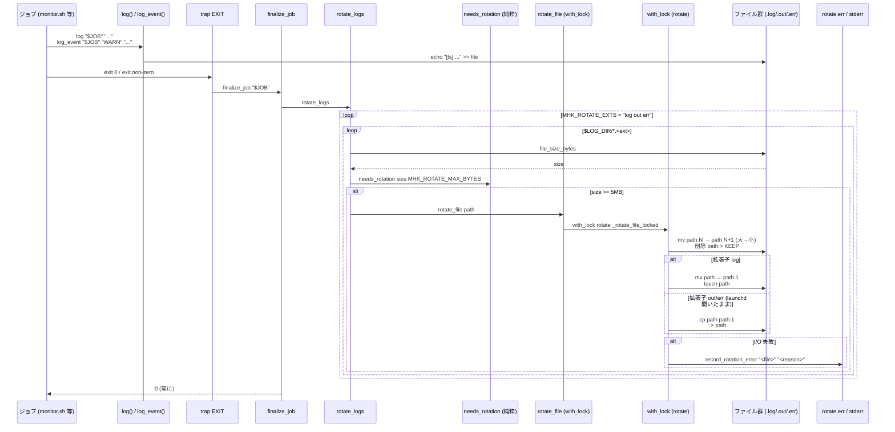
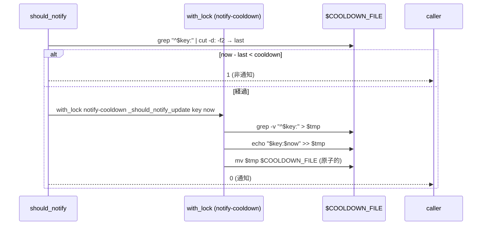

このドキュメントは、ログ書込・ローテーション・cooldown 制御の設計を定義します。

# ログとローテーション機能（F007）

## 概要

- ログ書込（`log` / `log_event`）と、サイズ世代ローテーション（`rotate_logs` / `rotate_file`）、共通終了処理（`finalize_job`）を `scripts/lib/log.sh` に集約する。
- 純粋関数（`needs_rotation` / `next_generation`）と実 I/O（`rotate_file_locked` / `rotate_logs`）を分離（Functional Core / Imperative Shell）。
- `with_lock rotate`（`scripts/lib/lock.sh`）で世代シフトを **直列化** し、多重実行時の衝突を防ぐ。
- 失敗は握り潰さず `rotate.err` と stderr に記録する（[05 エラー処理と外部通知](../../05_エラー処理と外部通知/README.md)）。

## 入出力

| 項目 | 値 |
| ---- | -- |
| 入力 | `$JOB`（ジョブ ID）・メッセージ文字列・`$LOG_DIR` 内の各 `*.log` / `*.out` / `*.err` |
| 出力 | 追記された行 / ローテートされた `<file>.<N>` ファイル / `rotate.err` への失敗記録 |
| 副作用 | ファイル追記・mv・cp・truncate・mkdir/rmdir（ロック） |

## F007-S1: ジョブの終了処理シーケンス

## F007-S2: cooldown 更新（read-modify-write）

## 関係モジュール

| ファイル | 役割 |
| -------- | ---- |
| `scripts/lib/log.sh` | ログ書込・ローテート・`finalize_job`・`record_rotation_error`。Core: `needs_rotation` / `next_generation`。 |
| `scripts/lib/lock.sh` | `acquire_lock` / `release_lock` / `with_lock`（mkdir ベース・固定パス）。 |
| `scripts/config/thresholds.sh` | `MHK_ROTATE_MAX_BYTES`（既定 5 MB）・`MHK_ROTATE_KEEP_GENERATIONS`（既定 3）・`MHK_ROTATE_EXTS`（既定 `"log out err"`）・`MHK_LOCK_TIMEOUT_SEC`（既定 5）。 |
| 各 `scripts/bin/*.sh` | 先頭で `trap 'finalize_job "$JOB"' EXIT` を設定（4 ジョブ共通）。 |

## 関連テスト

- `scripts/test/log_rotate.bats` / `log_rotate_test.sh` — `needs_rotation`・`next_generation`・世代シフト・truncate vs mv の分岐。

## 既知の制約

- launchd 出力（`.out` / `.err`）は launchd が fd を開いたまま保持するため、`mv` で退避すると新規ファイルを launchd が書き続けない。そこで `cp + truncate (: > file)` で原子的に空にする方式を採用している。
- ロック取得失敗（タイムアウト）は **記録して継続**（ベストエフォート）。重複したジョブ起動が短時間に発生すると、世代シフトの最中に他プロセスが介入し競合する可能性がある（許容範囲のリスクとして規定）。
- 世代ファイルの拡張子は `.log` / `.out` / `.err` のみ。新しい拡張子を追加する場合は `MHK_ROTATE_EXTS` を編集する。
- `rotate.err` 自身はローテートされない（無限ループ防止）。サイズが肥大化したら手動で削除可能。

---

## 参考資料

- [03 データ設計 §3.3.2-§3.3.8](../../03_データ設計/README.md#332-t07-jobログ各ジョブの実行ログ)
- [05 エラー処理と外部通知](../../05_エラー処理と外部通知/README.md)
- 一次情報: `scripts/lib/log.sh`・`scripts/lib/lock.sh`・`scripts/config/thresholds.sh`

---

**最終更新**: 2026 年 05 月 28 日 / **maintainer**: docs worker
