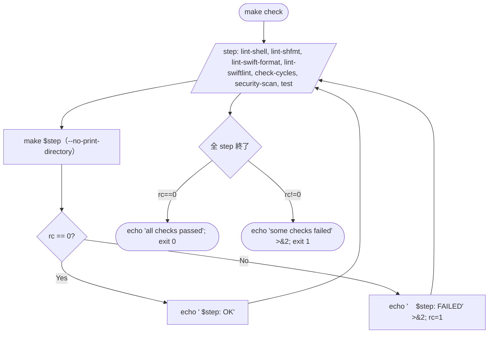

このドキュメントは、ローカル検証機能（`make check`）の設計を定義します。
システム仕様書作成ルールは [`.agents/DOCS_RULES.md`](../../../.agents/DOCS_RULES.md) を参照してください。

# ローカル検証機能（F009）

## 概要

`Makefile::check` ターゲットを起点に、シェル／Swift の lint・format 差分検査・シェル `source` 依存の循環検出・秘密情報や危険パターンの静的検出・テストを **一気通貫で実行**する検証機能。CI（[F010 CI・Release 自動化](../CI・Release自動化/README.md)）と同一スクリプトを呼ぶことでローカル／CI の挙動差を排除する。

- **配布物には含まれない**: 検証ランナーは `scripts/lint/` に隔離されており、`install.sh` がコピーする `scripts/{bin,lib,config}` の対象外。
- **bash 3.2 互換**: ランナーは GNU 拡張（連想配列・`mapfile`・`grep -P`）を使わない。共通関数は `scripts/lint/lib/common.sh` に集約。
- **任意ツールは SKIP**: `shfmt` / `swift-format` / `swiftlint` は未導入なら SKIP（`exit 0`）し検証は継続する。`shellcheck` のみ必須（不在で強い WARN + 非 0 終了）。

## 入出力

| 項目 | 値 |
| ---- | -- |
| 入力 | `make check` 起動。各ランナーは `repo_root()` でリポジトリルートを解決し `list_shell_files` / `list_swift_files` で対象を列挙。 |
| 出力 | 各 step の `[INFO]` / `[WARN]` / `[SKIP]` / `[ERROR]` ログ（stdout/stderr 分離）と、終了コード。 |
| 副作用 | なし（読み取り専用。`security-scan.sh` は一時ファイルを `${TMPDIR:-/tmp}` に生成し終了時に削除）。 |

## F009-S1: `make check` の処理フロー

## F009-S2: 各ランナーの I/F

| step | ランナー | 入力 | 必須／任意 | 終了コード | 主要オプション |
| ---- | -------- | ---- | ---------- | ---------- | -------------- |
| `lint-shell` | `scripts/lint/run-shellcheck.sh` | `list_shell_files()` | 必須 | shellcheck の rc をそのまま返す | `-x --severity=warning` |
| `lint-shfmt` | `scripts/lint/run-shfmt.sh` | `list_shell_files()` | 任意 | 差分あり非 0 | `-d -i 4 -ci` |
| `lint-swift-format` | `scripts/lint/run-swift-format.sh` | `list_swift_files()` | 任意 | rc 0/1 | `lint --strict` |
| `lint-swiftlint` | `scripts/lint/run-swiftlint.sh` | `cd repo_root` | 任意 | rc 0/1 | `--strict` |
| `check-cycles` | `scripts/lint/check-source-cycles.sh` | `list_shell_files()` | 必須 | 循環検出で非 0 | awk DFS（色塗り） |
| `security-scan` | `scripts/lint/security-scan.sh` | `list_shell_files()` + `list_swift_files()` | 必須 | 検出で非 0 | 6 種パターン |
| `test` | `make test` 委譲 | — | 必須 | ① `swift run MacHealthCheck`（v1.3.0 追加・必須・常時実行）→ ② `swift test`（XCTest 搭載時のみ・不在は SKIP）→ ③ シェルテスト（`bats` または自前 `*_test.sh` + `install_metrics_smoke_test.sh` + `version_stamp_test.sh`（v1.3.0・issue: 20260529_105524_ビルド時バージョン自動stamp 追加））の合算結果 | MacHealthCheck・シェルは必須 / XCTest 不在は SKIP |

### `list_shell_files` の対象範囲

`scripts/lint/lib/common.sh::list_shell_files` が返すパス（リポジトリ相対・1 行 1 ファイル・`sort -u`）:

- `scripts/{bin,lib,config,test}/*.sh`（`find ... -name '*.sh'`）
- `scripts/bin/mac-health`（拡張子なし CLI・存在時のみ）
- `install.sh` / `uninstall.sh`（存在時のみ）

> `scripts/lint/` 自身は除外される（自己参照防止・`security-scan.sh` 等が自身を誤検知するのを避ける）。

### `list_swift_files` の対象範囲

- `Sources/**/*.swift`
- `Tests/**/*.swift`

## 6 種のセキュリティパターン（`security-scan.sh`）

| ラベル | 正規表現（`grep -E`） | 意図 |
| ------ | --------------------- | ---- |
| `aws-access-key` | `AKIA[0-9A-Z]{16}` | AWS Access Key の生埋め込み検出 |
| `password-literal` | `[Pp][Aa][Ss][Ss][Ww][Oo][Rr][Dd][[:space:]]*=[[:space:]]*["'][^"']+["']` | `password = "..."` 文字列リテラル |
| `token-literal` | `[Tt][Oo][Kk][Ee][Nn][[:space:]]*=[[:space:]]*["'][^"']+["']` | `token = "..."` 文字列リテラル |
| `eval-usage` | `(^\|[^A-Za-z_])eval[[:space:]]+` | シェル `eval` の使用 |
| `rm-rf-var` | `rm[[:space:]]+-rf?[[:space:]]+\$` | unquoted 変数展開での `rm -rf $...` |
| `curl-pipe-sh` | `(curl\|wget)[^\|]*\|[[:space:]]*sh($\|[[:space:]])` | `curl ... \| sh` 形のリモート実行 |

- **除外マーカ**: 行末コメント `# noqa: security`（シェル）/ `// noqa: security`（Swift）。
- **自己除外**: `scripts/lint/(security-scan\.sh\|check-source-cycles\.sh\|lib/common\.sh)` をパス除外。

## `check-source-cycles.sh` の挙動

1. `list_shell_files` を対象とする。
2. 各ファイルから `^[[:space:]]*(source\|\.)[[:space:]]+<path>` 行を抽出。コメントは `#` 以降を除去。
3. 引数のクォートを剥がし、`$ROOT_DIR` / `${ROOT_DIR}` を `scripts` に、`$SCRIPT_DIR` / `${SCRIPT_DIR}` を当該ファイルのディレクトリ（リポジトリ相対）に置換。
4. 置換できない `$...` を含む引数はスキップ（動的依存）。
5. 残りを「ファイルのディレクトリからの相対」と解釈し、`..` を解決して正規化。
6. 解析対象集合内のエッジのみ `from<TAB>to` で出力し、awk DFS（`color[]` で gray / black 管理）で循環検出。
7. 循環あり → `CYCLE: a -> b -> ... -> a` を stderr に出力し非 0 終了。なし → 0 終了。

## 関係モジュール

| ファイル | 役割 |
| -------- | ---- |
| `Makefile`（`check` / `lint` / `lint-{shell,shfmt,swift-format,swiftlint}` / `check-cycles` / `security-scan` ターゲット） | step を順次呼び終了コードを集約。 |
| `scripts/lint/lib/common.sh` | ログ出力・ツール検出・対象ファイル列挙・リポジトリルート解決（bash 3.2 互換）。 |
| `scripts/lint/run-shellcheck.sh` / `run-shfmt.sh` / `run-swift-format.sh` / `run-swiftlint.sh` | 各 lint/format の薄いラッパ。任意ツールは SKIP。 |
| `scripts/lint/check-source-cycles.sh` | シェル `source` 依存グラフの循環検出。 |
| `scripts/lint/security-scan.sh` | 秘密情報・危険パターンの静的検出。 |

## 関連テスト

- ランナー自身は読み取り専用ユーティリティのため XCTest 対象外。
- `make check` が成功することそのものが回帰テストとして機能する（PR / `main` push 時に CI で実行・[F010 CI・Release 自動化](../CI・Release自動化/README.md)）。

## 既知の制約

- `shellcheck` 必須・他は任意の方針（[`README.md`](../../../README.md) と一致）。任意ツール未導入時は SKIP が増えるため、推奨設定で実行するには `brew install shfmt swift-format swiftlint` を行う。
- `check-source-cycles.sh` は **静的に解決できる `source` のみ**を対象とする。`$EXTERNAL_VAR/path` のような動的依存はスキップする（誤検知より見逃しを優先）。
- `security-scan.sh` は `grep -E` に閉じており、複雑なヒューリスティック（コンテキスト依存の安全パターン）は判別しない。`# noqa: security` で個別除外する。
- ランナーは bash 3.2 互換のため連想配列を使わず、`IFS` 改行で一時配列化する。空白を含むパスは想定外（本リポジトリの構成では発生しない）。

---

## 参考資料

- [`Makefile`](../../../Makefile)
- [`README.md` § ローカル検証](../../../README.md)
- [03 アーキテクチャ §3.8.1 ローカル検証（make check）と CI / Release 自動化](../../01_システム概要/03_アーキテクチャ/README.md)
- [F010 CI・Release 自動化](../CI・Release自動化/README.md)
- 一次情報: `Makefile`・`scripts/lint/*`

---

**最終更新**: 2026 年 05 月 29 日 / **maintainer**: docs worker
