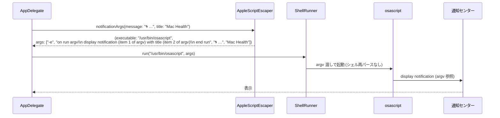

このドキュメントは、通知機能（注入耐性付き）の設計を定義します。

# 通知機能（F006・注入耐性付き）

## 概要

- デスクトップ通知（macOS 通知センター）を `osascript` 経由で発行する。
- **Swift 側**: `AppleScriptEscaper.notificationArgs(message:title:)` で argv 渡し（推奨・案 A）。`-e` の AppleScript 本体に message/title を **補間しない**。
- **シェル側**: `scripts/lib/notify.sh::notify` が `osascript -e "display notification \"$message\" with title \"$title\" [subtitle …]"` を実行する従来方式（v1.2 時点・案 B 相当）。
- 通知の連発を防ぐため、シェル側は **cooldown 制御**（`should_notify`）を持つ。

## 入出力

| 項目 | 値 |
| ---- | -- |
| 入力 | message / title（Swift）または title / message / subtitle（シェル） |
| 出力 | `osascript` の起動・通知センターへの表示 |
| 副作用 | `osascript` プロセス起動・cooldown ファイル更新 |

## F006-S1: Swift 側通知（argv 渡し・注入耐性）



- **注入耐性**: message が `"`, `\\`, 改行を含んでも AppleScript リテラルへ展開されない（argv 経由で参照のみ）。
- 通知タイトルは `"Mac Health"` 固定（`AppDelegate.notify(_:)`）。

## F006-S2: シェル側通知（cooldown 経由・案 B 相当）

```mermaid
sequenceDiagram
    participant J as ジョブ (monitor 等)
    participant SN as should_notify
    participant LK as with_lock (notify-cooldown)
    participant CF as $COOLDOWN_FILE (key:epoch)
    participant N as notify
    participant OS as osascript
    participant NC as 通知センター

    J->>SN: should_notify "<key>"
    SN->>CF: grep "^<key>:" 読取
    alt now - last < NOTIFICATION_COOLDOWN_MIN*60
        SN-->>J: 1 (非通知)
    else 経過
        SN->>LK: with_lock notify-cooldown _should_notify_update
        LK->>CF: grep -v "^<key>:" | echo "<key>:<now>" >> tmp; mv tmp file
        SN-->>J: 0 (通知)
        J->>N: notify "<title>" "<message>" "<subtitle>"
        N->>OS: osascript -e "display notification \\\"$message\\\" with title \\\"$title\\\" [subtitle \\\"$subtitle\\\"]"
        OS->>NC: 表示
    end
```

- **cooldown のロック**: `with_lock` 不在時はロックなしで継続（ベストエフォート）。
- **クールダウン値**: `NOTIFICATION_COOLDOWN_MIN=60`（monitor）／ハードコード 21600（docker 業務時間内）。
- **key**: monitor では `swap` / `compressed` / `load` / `pressure`。
- `notify.sh` の `osascript -e` は `$title` / `$message` をシェル変数として展開するため、現状の運用では呼び出し元（ジョブ側）の文言が固定リテラルであることに依存（02 §3.5 の安全化の今後の改善余地）。

## 関係モジュール

| ファイル | 役割 |
| -------- | ---- |
| `Sources/MacHealthKit/AppleScriptEscaper.swift` | `notificationArgs(message:title:)` / `escapeForAppleScriptLiteral(_:)` |
| `src/MacHealth.swift::notify(_:)` | argv 渡しの実呼出 |
| `scripts/lib/notify.sh::notify` | osascript ラッパ |
| `scripts/lib/notify.sh::is_business_hours` | 業務時間判定（08-21 時） |
| `scripts/bin/notification_cooldown.sh` | `should_notify` / `classify_pressure` / `exceeds_threshold` |
| `scripts/lib/lock.sh::with_lock` | cooldown 更新の直列化 |

## 関連テスト

- `Tests/MacHealthKitTests/AppleScriptEscaperTests.swift` — argv 戻り値の構造とリテラルエスケープの全域性。
- `scripts/test/monitor.bats` / `monitor_test.sh` — `should_notify` の cooldown 経過判定・更新挙動。

## 既知の制約

- `notify.sh::notify` は文字列補間で AppleScript を組み立てるため、`$title` / `$message` に `"` / `\` を含めるとパースエラーになる可能性がある。現状の呼び出し元は固定リテラルのみで安全だが、ユーザー入力が流入する場合は Swift 側同様の argv 渡し化が必要（今後の改善余地）。
- 通知センターの表示は macOS の集約挙動（同じアプリの通知を折り畳むなど）に依存する。
- ジョブの cooldown ファイルが破損／不正書式の場合、`grep "^$key:" | cut -d: -f2` は空文字 → `0` 扱いとなり、必ず通知される（フェイルセーフ）。

---

## 参考資料

- [05 エラー処理と外部通知](../../05_エラー処理と外部通知/README.md)
- [03 データ設計 §3.3.6 COOLDOWN_FILE](../../03_データ設計/README.md#336-t11-cooldown_file通知クールダウン)
- 一次情報: `Sources/MacHealthKit/AppleScriptEscaper.swift`・`scripts/lib/notify.sh`・`scripts/bin/notification_cooldown.sh`

---

**最終更新**: 2026 年 05 月 28 日 / **maintainer**: docs worker
