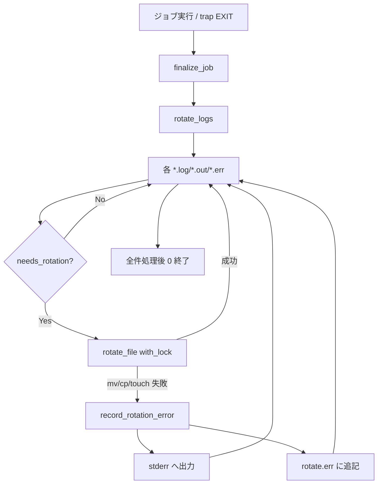
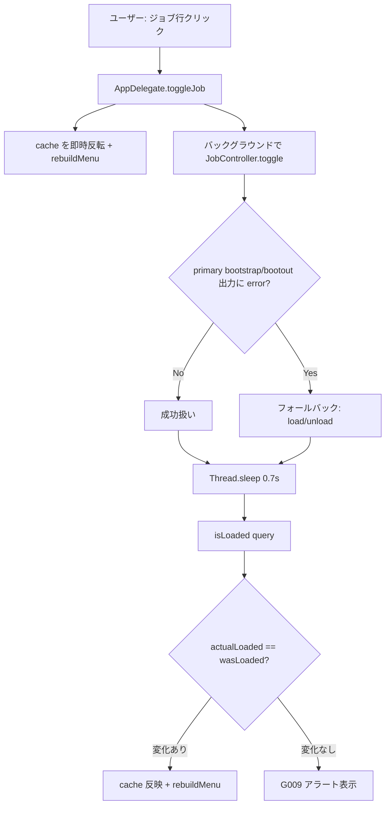

このドキュメントは、Mac Health Keeper のエラー処理方針と外部通知（macOS 通知センター）の設計を定義します。
システム仕様書作成ルールは [`.agents/DOCS_RULES.md`](../../.agents/DOCS_RULES.md) を参照してください。

> 本ドキュメントは「生きているドキュメント」です。実装変更時に更新し、レビュー結果は [`docs/00_review/`](../00_review/) に記録します。

# 5. エラー処理と外部通知

Mac Health Keeper は **HTTP サーバ／RPC を持たない** スタンドアロンアプリ + launchd バッチであり、テンプレート（API サーバ向け）の Exception ハンドラ集約方針は直接該当しません。本章では本プロジェクト固有のエラー分類・処理方針・外部通知（macOS 通知センター）・観測点を定義します。

---

## 5.1. エラー分類と取り扱い

| 分類 | 発生箇所 | 取り扱い | 一次情報 |
| ---- | -------- | -------- | -------- |
| ローテート失敗 | `scripts/lib/log.sh::rotate_file` の `mv` / `cp` / `touch` / `: > path` 失敗 | `record_rotation_error <file> <reason>` で **stderr + `$LOG_DIR/rotate.err`** に記録し、処理は **継続**。再帰回避のため `rotate.err` 自体は記録のみ。 | `scripts/lib/log.sh` |
| ロック取得失敗 | `scripts/lib/lock.sh::with_lock`（`acquire_lock` がタイムアウト 5 秒） | **ベストエフォートでロックなし継続**し `record_rotation_error <name>.lock "lock acquisition failed; proceeding without lock"` を記録。ジョブ本体は止めない（可用性方針）。 | `scripts/lib/lock.sh` |
| ジョブ起動／停止失敗 | `JobController.load/unload` の `bootstrap`/`bootout` がエラー出力 | **stdout/stderr の文字列マッチ**（`error/failed/not permitted/no such/could not/invalid`）で判定し、二次コマンド（`launchctl load`/`unload`）にフォールバック。0.7 秒後 `isLoaded` で実態確認し、状態が変わっていなければ **G009 アラート** を表示。 | `Sources/MacHealthKit/JobController.swift::bootstrapSucceeded` / `src/MacHealth.swift::toggleJob` |
| 通知失敗 | `osascript` がエラー / 通知センター未許可 | **無視可**。`osascript` の戻り値は破棄（`2>/dev/null`、シェル側）。Swift 側も `ShellRunner.run` の戻り値を破棄。 | `scripts/lib/notify.sh` / `src/MacHealth.swift::notify(_:)` |
| `ShellRunner.run` 失敗（Process throw） | `Process.run()` の throw | **空文字 `""` を返す**（現状互換）。呼び出し元は trim 後の空チェックで判断する。 | `Sources/MacHealthKit/ShellRunner.swift::ZshShellRunner.run` |
| メトリクス取得失敗 | `metrics.sh` / `shellFixed` が空応答 | `MetricsParser` が `"—"` フォールバックを返し UI に **「—」表示**。compressed は `0.0 GB`、docker count は `?`。 | `Sources/MacHealthKit/MetricsParser.swift` / `scripts/lib/metrics.sh` |
| Docker `docker ps` ハング | `docker ps -q` が応答せず 3 秒経過 | バックグラウンド + `sleep 3; kill -9` でタイムアウトし `?` を返す。ジョブは継続。 | `scripts/bin/check-docker.sh` / `src/MetricsCollector.swift::collect` |
| アプリの Quit 失敗 | `refresh.sh::quit_app` で `quit saving no` がエラー（dirty 等） | `log_event "$JOB" WARN "$app: quit returned error (likely dirty), skip"` を記録し **その app をスキップ**。次の app へ。 | `scripts/bin/refresh.sh` |
| アプリの Quit タイムアウト | `wait_for_quit` 30 秒経過 | 同上の WARN ログを残し再起動せずスキップ。 | `scripts/bin/refresh.sh` |
| install/uninstall の途中失敗 | `launchctl bootstrap` 失敗等 | `|| launchctl load`／`|| true` で次のステップへ進む（部分失敗を許容）。ユーザーには `⚠️` を出力。 | `install.sh` / `uninstall.sh` |

> 全体方針: **観測しても止めない**（ユーザーのバックグラウンド作業を守る）。重要な失敗は **記録（events.log / rotate.err / stderr）+ 必要なら UI アラート** に留める。

---

## 5.2. エラー処理の流れ（図）

### 5.2.1. ローテート失敗の流れ

### 5.2.2. ジョブ ON/OFF 失敗の流れ

---

## 5.3. 外部通知（macOS 通知センター）

本プロジェクトの「外部通知」は **macOS 通知センター** のみ。Rollbar / Slack / Sentry 等の外部 SaaS には送信しません。

| 経路 | 実装 | 注入耐性 |
| ---- | ---- | -------- |
| Swift 側 | `Sources/MacHealthKit/AppleScriptEscaper.notificationArgs(message:title:)` で `osascript` を **argv 渡し** で起動（案 A）。`-e` のスクリプトに message/title を補間しない。 | 高（"・\・改行 OK） |
| シェル側 | `scripts/lib/notify.sh::notify <title> <message> [subtitle]` で `osascript -e "display notification \"$message\" with title \"$title\" …"`（文字列補間あり）。呼び出し元の文言は固定リテラルのみで使用する。 | 中（ユーザー入力流入なし前提） |

### 5.3.1. cooldown による通知重複の抑制

| ジョブ | cooldown | 実装 |
| ------ | -------- | ---- |
| monitor の 4 種（swap/compressed/load/pressure） | `NOTIFICATION_COOLDOWN_MIN`（既定 60 分） | `scripts/bin/notification_cooldown.sh::should_notify` + `with_lock notify-cooldown` |
| docker 業務時間内通知 | 21600 秒（6 時間）ハードコード | `scripts/bin/check-docker.sh` |
| uptime | なし（毎日 9:00 で 1 回） | — |
| refresh | なし（毎日 3:00 で結果通知 1 回） | — |
| Swift 側通知（クイック対処等） | なし（ユーザー操作トリガのため不要） | — |

### 5.3.2. 通知レベル指針（events.log の LEVEL）

| LEVEL | 用途 | 例 |
| ----- | ---- | -- |
| `INFO` | 情報通知（ユーザーに知らせるが対処不要） | `uptime 35 days exceeded 30` / `AppRefresh completed: refreshed=4 skipped=1` / `docker idle 60 min during business hours (notify only)` |
| `WARN` | 警告（対処推奨だが自動対応せず） | `swap usage 5120MB exceeded threshold 5000MB` / `memory pressure critical` / `Slack: quit returned error (likely dirty), skip` |
| `ACTION` | 自動対処を実施 | `auto-quit Docker Desktop (idle 35 min, off-hours)` / `Slack: refreshed` |

> `[ERROR]` は **`rotate.err` の専用ログ** のみ使用（`events.log` には書き込まない・[03 データ設計 §3.3.5](../03_データ設計/README.md#335-t10-rotateerrローテート失敗の専用ログ)）。

---

## 5.4. 運用上の観測点

| 観測点 | パス | 用途 |
| ------ | ---- | ---- |
| 通知履歴 | `$HOME/Library/Logs/MacHealth/events.log` | ユーザー通知された出来事の全履歴。`mac-health events` でも参照可。 |
| 各ジョブの実行ログ | `$HOME/Library/Logs/MacHealth/<job>.log` | 各実行の入出力（メトリクス値・経過分）。`mac-health logs [N]` で末尾参照。 |
| launchd 標準出力／エラー | `$HOME/Library/Logs/MacHealth/launchd.<job>.{out,err}` | スクリプト未捕捉の stdout/stderr。 |
| ローテート失敗 | `$HOME/Library/Logs/MacHealth/rotate.err` | `record_rotation_error` の累積。stderr にも同時に出力される。 |
| ロックファイル | `$HOME/Library/Logs/MacHealth/.locks/<name>.lock` | `rotate` / `notify-cooldown` の取得中はディレクトリとして存在。停止後に残っていれば手動 `rmdir` で解放可。 |
| Docker 状態 | `$HOME/Library/Logs/MacHealth/.docker-state` | アイドル開始時刻（epoch）。 |
| 通知 cooldown | `$HOME/Library/Logs/MacHealth/.monitor-cooldown` / `.docker-notify-cooldown` | 各 key の最終通知時刻。 |

### 5.4.1. トラブルシュート手順（参考）

| 症状 | 観測点 / 対処 |
| ---- | ------------- |
| 通知が出ない | `events.log` に該当行があれば「通知送信は成功」。出ない場合は通知センター設定（システム設定 → 通知 → osascript / Mac Health）を確認。 |
| 通知が多すぎる | `.monitor-cooldown` を確認。`NOTIFICATION_COOLDOWN_MIN` を増やす。 |
| ジョブが動かない | `mac-health status` で loaded 状態を確認。`<job>.log` の mtime が古ければ `launchctl bootstrap`/`bootout` を試す。 |
| ローテートが失敗 | `rotate.err` を確認。ディスク容量・パーミッションを確認。 |
| Docker が即 Quit される | `DOCKER_IDLE_GRACE_MINUTES` を増やす。業務時間設定（`is_business_hours` の `[8, 22)`）を確認。 |
| 自動再起動で予期せぬアプリが落ちる | `scripts/bin/refresh.sh` の `APPS` 配列を編集。Cursor 等は除外。 |

---

## 5.5. 実装時のチェックリスト

- [ ] 新規スクリプトは `trap 'finalize_job "$JOB"' EXIT` を必ず設定する（02 §3.3 / [04 機能設計 / 監視ジョブ](../04_機能設計/監視ジョブ/README.md)）。
- [ ] 失敗するかもしれない I/O は `record_rotation_error` 相当のロガーで stderr + 専用ファイルに残す。握り潰さない（[ローテート失敗の流れ](#521-ローテート失敗の流れ)）。
- [ ] 新規通知箇所は **argv 渡し**（Swift）または **固定リテラル**（シェル）で組む。ユーザー入力を AppleScript リテラルへ補間しない（[04 機能設計 / 通知](../04_機能設計/通知/README.md)）。
- [ ] 新規 launchctl 呼出は `ShellRunner.run(executable: "/bin/launchctl", args: [...])` の引数配列で書く。`/bin/zsh -c` 経由で組み立てない（02 §3.5）。
- [ ] 新規 cooldown キーを追加する場合は `should_notify <key>` を経由し、`with_lock notify-cooldown` で read-modify-write を直列化する。
- [ ] launchd 出力（`.out` / `.err`）は `mv` で退避できない（fd を保持）。ローテートは `cp + : > path` で行うこと。

---

## 参考資料

- [03 アーキテクチャ §3.5 ログ・通知・設定](../01_システム概要/03_アーキテクチャ/README.md#35-ログ通知設定)
- [03 データ設計 §3.3 / §3.5 / §3.3.5（rotate.err）](../03_データ設計/README.md#33-ファイル形式永続データ)
- [04 機能設計 / ログとローテーション](../04_機能設計/ログとローテーション/README.md)
- [04 機能設計 / 通知](../04_機能設計/通知/README.md)
- [04 機能設計 / ジョブ ON_OFF](../04_機能設計/ジョブON_OFF/README.md)
- 一次情報: `scripts/lib/log.sh`・`scripts/lib/lock.sh`・`scripts/lib/notify.sh`・`scripts/bin/notification_cooldown.sh`・`Sources/MacHealthKit/JobController.swift`

---

**最終更新**: 2026 年 05 月 28 日 / **maintainer**: docs worker
